# 🖥️ Proxmox & Rocky Linux Cluster

[← Workfolio](../../README.md)


> **Projektstatus am 10.08.2026 – Blockiert bei OpenFOAM-Funktionstest:** `openfoam@2512` ist mit Hash `m7gklin`, Compiler `gcc@13.4.0` und Target `x86_64_v2` installiert. `spack load /m7gklin` lief ohne sichtbare Fehlermeldung. Der anschließende Test aus Abschnitt 13.2.3, `interFoam -help`, endet jedoch mit `bash: interFoam: command not found`; auch die falsche Kleinschreibung `interfoam` wurde nicht gefunden. Ein lesbarer Screenshot vom Headnode dokumentiert den Fehler. Diagnoseergebnis: `spack find --loaded` zeigt genau ein geladenes Package, `openfoam@2512`, unter `linux-rocky9-x86_64_v2` mit `gcc@13.4.0`. Der Spec ist somit in der aktuellen Shell geladen; die Ursache liegt wahrscheinlich darin, dass der Pfad zur ausführbaren Datei nicht in `PATH` eingetragen wurde. Der erste Suchversuch wurde als `root` ausgeführt und scheiterte mit `spack: command not found`. Nach dem Tippfehler `su spacl` wurde korrekt zu `spack` gewechselt; dabei blieb das Arbeitsverzeichnis jedoch `/root`, auf das der Benutzer `spack` keinen Zugriff hat. Deshalb endete `find` mit `Failed to restore initial working directory: /root: Permission denied`. Nach dem Wechsel nach `/home/spack` lief die read-only Suche ohne Berechtigungsfehler durch, lieferte jedoch keine Ausgabe. Damit wurde keine reguläre ausführbare Datei namens `interFoam` gefunden. Der Befehl wurde versehentlich ein zweites Mal gestartet; eine Wiederholung ist nicht erforderlich. Die Suche ohne Typfilter fand zwei Einträge: `applications/solvers/multiphase/interFoam` und `tutorials/multiphase/interFoam`. Beide Pfade gehören zur Source-/Tutorial-Struktur; ein ausführbares Programm wurde damit noch nicht nachgewiesen. Die Liste der ausführbaren Dateien in den `bin`-Verzeichnissen enthält zahlreiche OpenFOAM-Skripte wie `foamInstallationTest`, `paraFoam` und `foamExec`, aber keinen Solver-Binary wie `interFoam`. Damit ist ein reines `PATH`-Problem unwahrscheinlich; möglicherweise fehlt die kompilierte `platforms`-Struktur. Die `platforms`-Prüfung zeigt eine kompilierte Plattform `linux64GccDPInt32-spack` mit eigenen Verzeichnissen `bin` und `lib`. OpenFOAM wurde somit kompiliert. Wahrscheinliche Ursache: `spack load` hat zwar das allgemeine `bin`, aber nicht das plattformspezifische Solver-Verzeichnis in `PATH` aufgenommen. Die gezielte Suche nach `platforms/*/bin/interFoam` lieferte keine Ausgabe. Damit existiert der Solver-Binary in der kompilierten Plattform nicht; ein reines `PATH`-Problem ist ausgeschlossen. Vor einem Build- oder Konfigurationsschritt muss read-only geprüft werden, welche ausführbaren Dateien im plattformspezifischen `bin` überhaupt vorhanden sind. Das Ergebnis zeigt, ob alle Solver oder nur `interFoam` fehlen.

## Tagesbericht – 07.08.2026
- GCC 13.4.0 mit Spack installiert, den eindeutigen Build über den Hash `avwozlz` geladen und als Compiler für die weiteren HPC-Pakete verwendet.
- OpenMPI 5.0.10 mit GCC 13.4.0 installiert, geladen und den Installations-Hash `wuhedqo` für die OpenFOAM-Abhängigkeit ermittelt.
- Den Downloadfehler bei `readline@8.3` analysiert: direkter GNU-Server erreichbar, verwendeter GNU-Mirror mit HTTP 502 fehlerhaft; daraufhin einen geprüften lokalen Source-Mirror eingerichtet.
- OpenFOAM 2512 einschließlich der restlichen Abhängigkeiten erfolgreich installiert; Hash `m7gklin` bestätigt, Load- und Funktionstest für die nächste Arbeitseinheit vorgemerkt.
## 1. Projektübersicht
### Projektziel
Ziel ist der schrittweise Aufbau eines Linux-Clusters auf einer Proxmox-Umgebung. Ein Headnode stellt zentrale Dienste, Storage und Verwaltung bereit. Node01 dient als erster Compute Node. Alle Schritte werden nach der Anleitung **„Cluster installation unter Rocky Linux 9“** durchgeführt und technisch dokumentiert.
### Aktueller Aufbau
- **Virtualisierungsplattform:** Proxmox
- **Headnode:** Rocky Linux 9.8, VM 142
- **Compute Node:** Rocky Linux 9.8, VM 188
- **Externes Netz:** `192.168.50.0/24`
- **Internes Clusternetz:** `10.0.100.0/24`
- **Zentraler Speicher:** ZFS auf dem Headnode
- **Gemeinsamer Speicher:** NFS
- **Remote-Zugriff:** SSH und XRDP
- **Monitoring:** Ganglia – Headnode und Node01 aktiv
## 2. Architektur und Planung
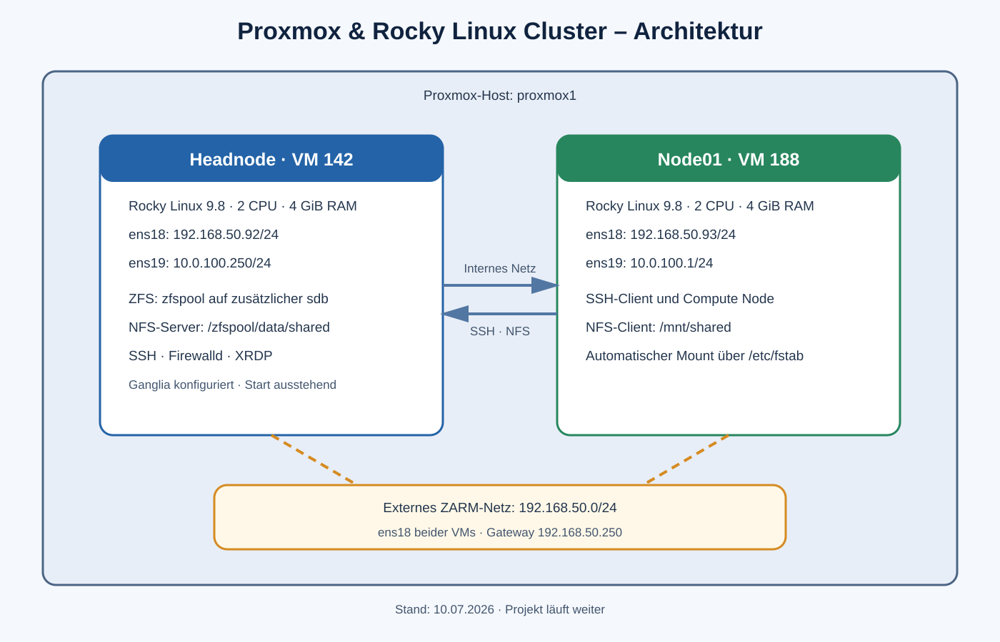
### Netzwerkplanung
- **Headnode / ens18:** `192.168.50.92/24` – Verbindung zum externen ZARM-Netz
- **Headnode / ens19:** `10.0.100.250/24` – internes Clusternetz
- **Node01 / ens18:** `192.168.50.93/24` – Verbindung zum externen ZARM-Netz
- **Node01 / ens19:** `10.0.100.1/24` – internes Clusternetz
- **Gateway:** `192.168.50.250`
Die Trennung der Netze sorgt dafür, dass die Kommunikation zwischen den Cluster-Knoten über `ens19` läuft. Dienste wie NFS werden gezielt nur im internen Netz freigegeben.
### Storage-Planung
Der Headnode besitzt neben dem Systemdatenträger eine zusätzliche Festplatte `sdb`. Darauf wurde der ZFS-Pool `zfspool` mit dem Dataset `zfspool/data` erstellt. Der Ordner `/zfspool/data/shared` wird über NFS für Node01 bereitgestellt.
## 3. Umsetzung – Schritt für Schritt
### 3.1 Virtuelle Maschinen in Proxmox
Für den Cluster wurden zwei virtuelle Maschinen eingerichtet. Beide Systeme besitzen zwei virtuelle CPUs, 4 GiB RAM und eine 32-GiB-Systemfestplatte. Der Headnode verwendet zusätzlich eine Festplatte für ZFS.
#### Headnode in Proxmox
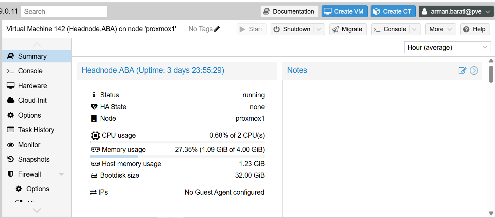
*Abbildung 1: Proxmox-Summary der VM 142 „Headnode.ABA“.*
#### Node01 in Proxmox
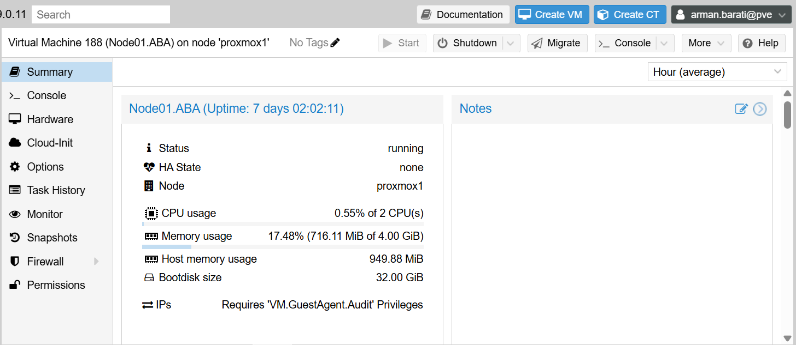
*Abbildung 2: Proxmox-Summary der VM 188 „Node01.ABA“.*
### 3.2 Betriebssystem und Netzwerkschnittstellen
Auf beiden VMs wurde Rocky Linux 9.8 installiert. Jede VM verwendet zwei Netzwerkschnittstellen: `ens18` für das externe Netz und `ens19` für die interne Clusterkommunikation.
#### Headnode
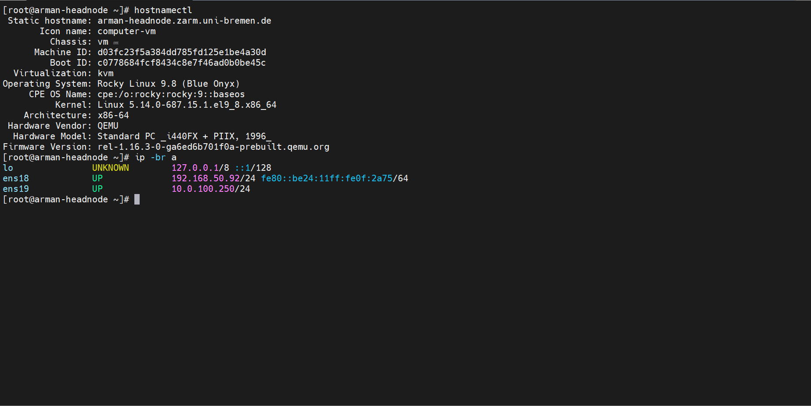
*Abbildung 3: Hostname, Betriebssystem und IP-Adressen des Headnodes.*
#### Node01
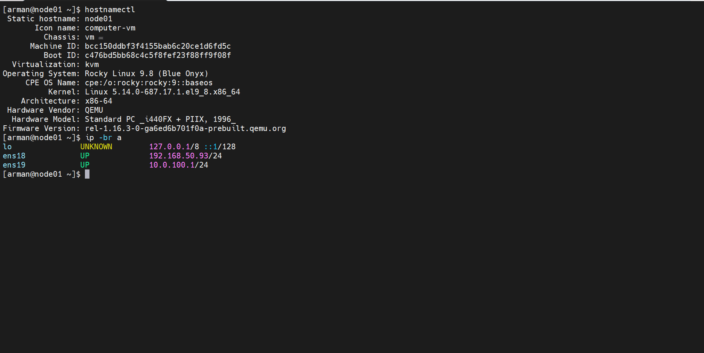
*Abbildung 4: Hostname, Betriebssystem und IP-Adressen von Node01.*
Wichtige Prüfkommandos:
```bash
hostnamectl
ip -br a
ip route
```
### 3.3 Interne Kommunikation und SSH
Nach der Netzwerkkonfiguration wurde die Erreichbarkeit in beide Richtungen getestet. Anschließend wurde eine SSH-Verbindung vom Headnode zu Node01 aufgebaut.
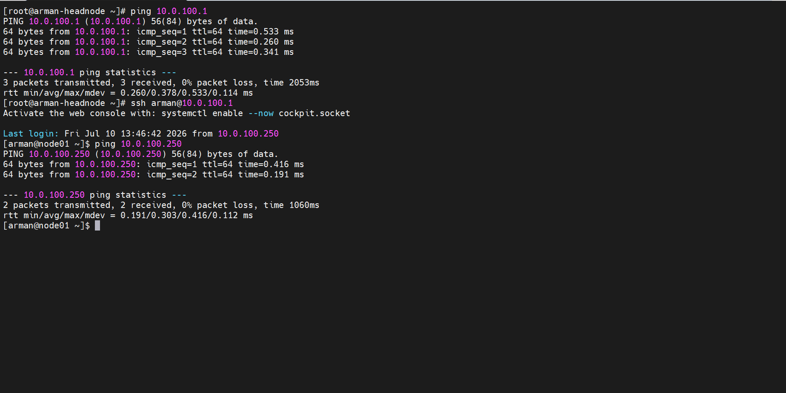
*Abbildung 5: Bidirektionaler Ping-Test und erfolgreicher SSH-Zugriff auf Node01.*
Ergebnis:
- Headnode → Node01: erreichbar
- Node01 → Headnode: erreichbar
- Paketverlust: `0 %`
- Latenz im internen Netz: ungefähr `0,2–0,5 ms`
- SSH-Anmeldung: erfolgreich
### 3.4 ZFS auf dem Headnode
Auf der zusätzlichen Festplatte `sdb` wurde der Pool `zfspool` eingerichtet. Das Dataset `zfspool/data` dient als Basis für den gemeinsamen Speicher.
Wichtige Eigenschaften:
- `compression=lz4`
- `atime=off`
- `xattr=sa`
- `acltype=posix`
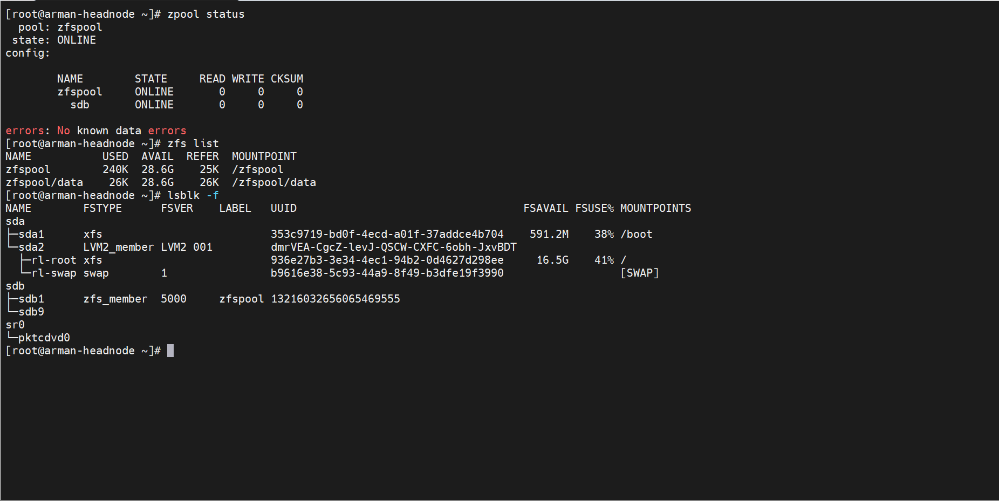
*Abbildung 6: ZFS-Pool, Datasets und Datenträgerstruktur.*
Testergebnis:
- Poolstatus: `ONLINE`
- Lese-, Schreib- und Prüfsummenfehler: `0`
- Bekannte Datenfehler: keine
- Freier Speicher: ungefähr `28,6 GiB`
Wichtige Kommandos:
```bash
zpool status
zfs list
lsblk -f
```
### 3.5 NFS-Server auf dem Headnode
Der Ordner `/zfspool/data/shared` wurde für das interne Netzwerk `10.0.100.0/24` exportiert. Der NFS-Dienst ist aktiviert und wird beim Systemstart automatisch geladen.
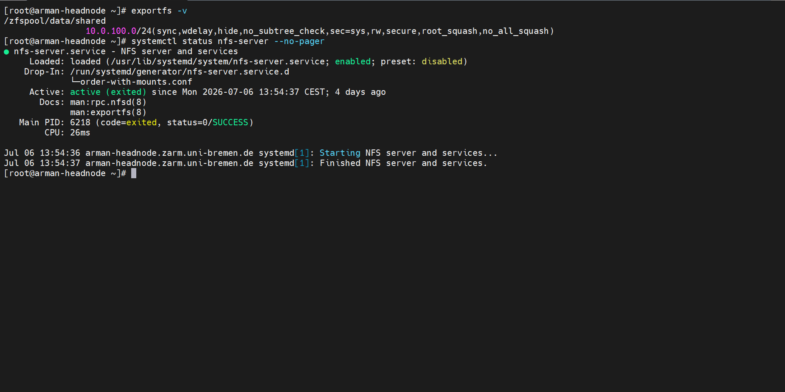
*Abbildung 7: Aktive NFS-Freigabe und Status des NFS-Servers.*
Wichtige Kommandos:
```bash
exportfs -v
systemctl status nfs-server --no-pager
```
### 3.6 Firewall-Trennung
Anfangs waren `ens18` und `ens19` derselben öffentlichen Firewall-Zone zugeordnet. Für eine saubere Trennung wurde `ens19` in die Zone `internal` verschoben. NFS, mountd und rpc-bind sind damit nur gezielt im internen Clusterbereich freigegeben.
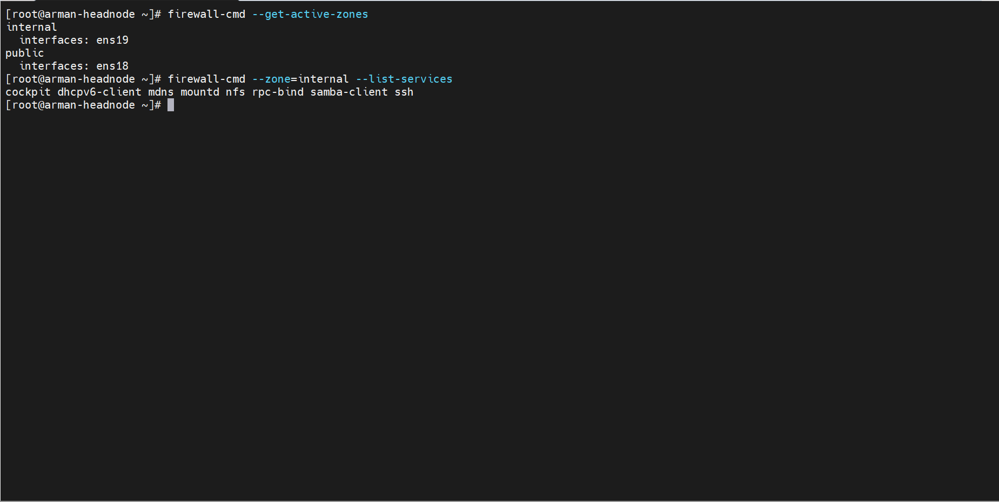
*Abbildung 8: Zuordnung der Netzwerkschnittstellen und NFS-Dienste in Firewalld.*
### 3.7 NFS-Client auf Node01
Auf Node01 wurde die Freigabe des Headnodes unter `/mnt/shared` eingebunden. Ein Eintrag in `/etc/fstab` sorgt für das automatische Mounten nach einem Neustart.
```plain text
10.0.100.250:/zfspool/data/shared /mnt/shared nfs defaults,_netdev 0 0
```
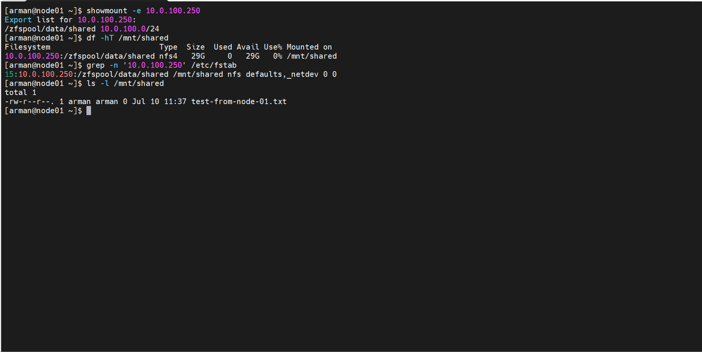
*Abbildung 9: Sichtbare NFS-Freigabe, aktiver Mount und dauerhafter fstab-Eintrag.*
Wichtige Kommandos:
```bash
showmount -e 10.0.100.250
df -hT /mnt/shared
mount -a
```
### 3.8 Schreibtest des gemeinsamen Speichers
Auf Node01 wurde eine Testdatei im NFS-Verzeichnis erstellt. Nach dem Beenden der SSH-Verbindung wurde dieselbe Datei direkt aus dem ZFS-Pfad des Headnodes gelesen.
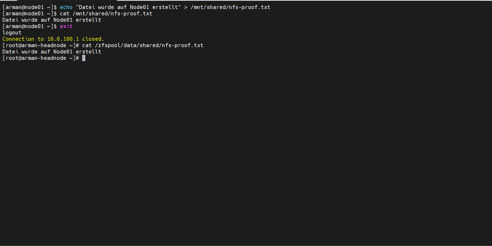
*Abbildung 10: Erfolgreicher Schreib- und Lesetest zwischen Node01 und Headnode.*
Damit ist nachgewiesen, dass Daten von Node01 über NFS tatsächlich auf dem ZFS-Speicher des Headnodes abgelegt werden.
### 3.9 Ganglia-Dienste auf dem Headnode
Die Eigentümerrechte des RRD-Verzeichnisses wurden zuerst kontrolliert. `/var/lib/ganglia/rrds` gehörte bereits dem Benutzer und der Gruppe `ganglia`; deshalb war keine erneute Änderung mit `chown` nötig.
Anschließend wurden `gmetad` und `gmond` gestartet und für den automatischen Systemstart aktiviert:
```bash
systemctl enable --now gmetad gmond
systemctl status gmetad gmond --no-pager
```
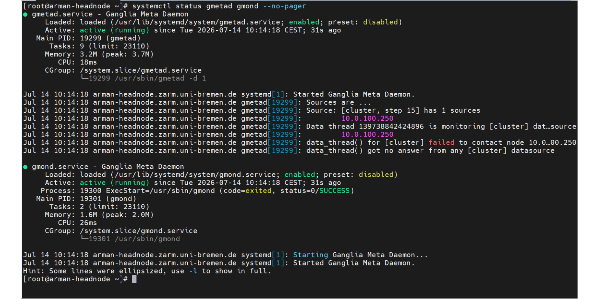
*Abbildung 11: **`gmetad`** und **`gmond`** sind auf dem Headnode aktiviert und laufen.*
#### Einzelprüfung von gmond
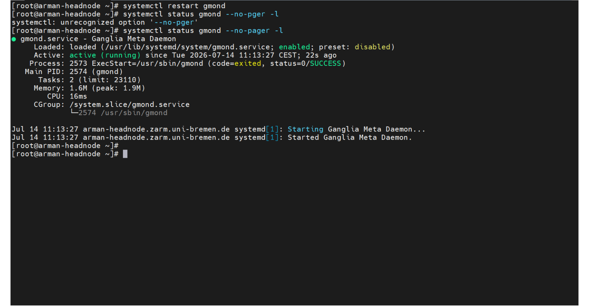
*Abbildung 12: Einzelprüfung nach dem Neustart: **`gmond`** ist **`enabled`** und **`active (running)`**; der Start wurde mit **`SUCCESS`** abgeschlossen.*
Beim ersten Statusaufruf wurde `--no-pger` falsch geschrieben. Der Befehl wurde direkt danach korrekt mit `--no-pager -l` ausgeführt. Diese Eingabekorrektur hatte keine Auswirkung auf den laufenden Dienst.
Ergebnis:
- Beide Dienste sind `enabled`.
- Beide Dienste sind `active (running)`.
- `gmetad` versucht, die Datenquelle `10.0.100.250` abzufragen.
- Nach der Firewall-Freigabe überwacht `gmetad` die Datenquelle `10.0.100.250` erfolgreich.
#### Erfolgreiche Verbindung zwischen gmetad und gmond
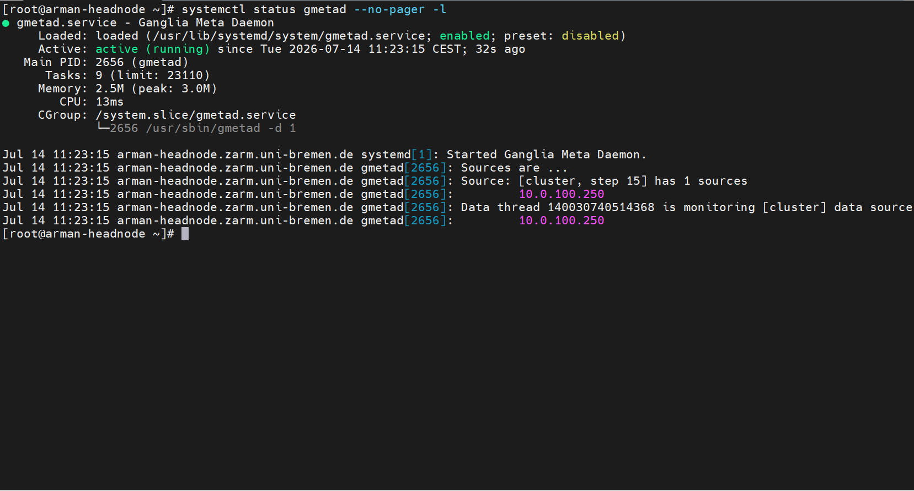
*Abbildung 13: **`gmetad`** ist aktiv und überwacht nach der Firewall-Korrektur erfolgreich die Cluster-Datenquelle **`10.0.100.250`**.*
### 3.10 Ganglia gmond auf Node01
Auf Node01 wurde zuerst das EPEL-Repository installiert, da das Paket `ganglia-gmond` in den vorhandenen Rocky-Linux-Paketquellen nicht gefunden wurde. Anschließend wurde `ganglia-gmond` erfolgreich installiert. Der Dienst wurde nach der Anleitung gestartet und für den automatischen Systemstart aktiviert:
```bash
sudo dnf install epel-release
sudo dnf install ganglia-gmond
sudo systemctl start gmond
sudo systemctl enable gmond
```
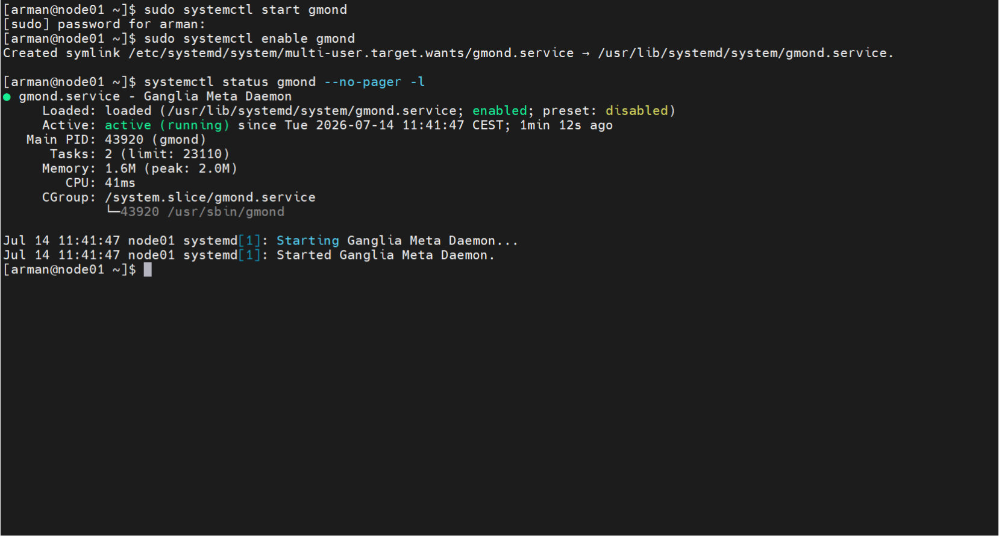
*Abbildung 14: **`gmond`** ist auf Node01 installiert, **`enabled`** und **`active (running)`**.*
Ergebnis:
- EPEL ist auf Node01 installiert.
- `ganglia-gmond` wurde erfolgreich installiert.
- `gmond` läuft auf Node01.
- Der Dienst startet nach einem Neustart automatisch.
### 3.11 IPMI-Werkzeug
Nach Abschnitt 11 der Anleitung wurde `ipmitool` auf dem Headnode installiert. Das Werkzeug dient bei physischen Servern zur Fernverwaltung und zur Abfrage von Hardwareinformationen. Da der aktuelle Cluster aus Proxmox-VMs besteht, wurde in diesem Schritt nur das vorgeschriebene Paket installiert.
```bash
dnf -y install ipmitool
rpm -q ipmitool
```
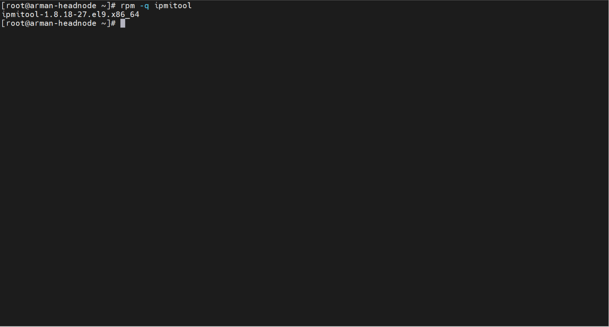
*Abbildung 15: Die installierte Version **`ipmitool-1.8.18-27.el9.x86_64`** auf dem Headnode.*
**Ergebnis:** Abschnitt 11 „IPMI“ ist nach Anleitung abgeschlossen.
### 3.12 InfiniBand- und RDMA-Unterstützung
Nach Abschnitt 12 der Anleitung wurden die InfiniBand- und RDMA-Paketgruppen sowie Diagnose- und Performance-Werkzeuge installiert. Danach wurden die vorgesehenen RDMA-Module in `/etc/rdma/modules/rdma.conf` aktiviert und der Modul-Dienst neu gestartet.
Wichtige Schritte:
```bash
dnf groupinstall "Infiniband Support"
dnf install rdma-core libibverbs-devel opensm opensm-devel infiniband-diags infiniband-diags-devel libibmad-devel perftest qperf
systemctl restart rdma-load-modules@rdma.service
nano /etc/rdma/modules/rdma.conf
ibv_devices
```
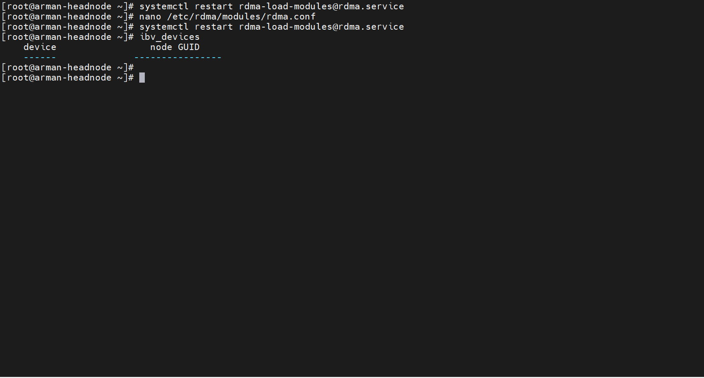
*Abbildung 16: RDMA-Konfiguration und Geräteprüfung auf dem Headnode; **`ibv_devices`** erkennt kein InfiniBand-Gerät.*
**Ergebnis:** Die Softwareunterstützung ist installiert und konfiguriert. Da die Proxmox-VM kein physisches oder durchgereichtes InfiniBand-Gerät besitzt, bleibt die Geräteliste leer. Die hardwareabhängigen Tests mit `mlx4_1`, `ibstat` und `ibping` sind deshalb in dieser Umgebung nicht ausführbar und wurden nicht künstlich ausgeführt.
### 3.13 Abschlussprüfung des Headnodes
Zum Abschluss wurden die zentralen Dienste, der ZFS-Speicher und der NFS-Export gemeinsam kontrolliert.
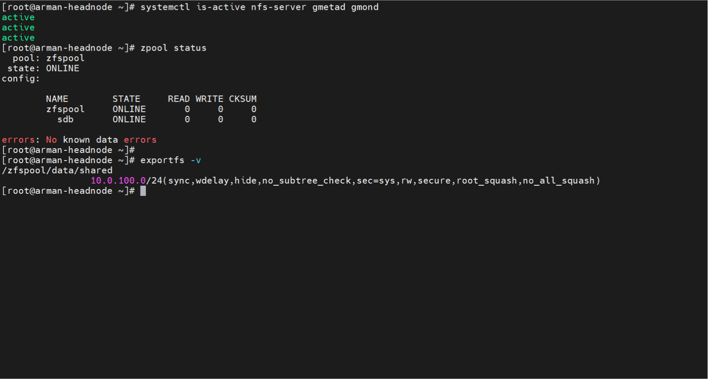
*Abbildung 17: Erfolgreiche Abschlussprüfung des Headnodes: NFS, gmetad und gmond sind aktiv; der ZFS-Pool ist online und fehlerfrei; die Freigabe ist auf **`10.0.100.0/24`** begrenzt.*
Ergebnisse:
- `nfs-server`, `gmetad` und `gmond`: `active`
- ZFS-Pool `zfspool`: `ONLINE`
- Lese-, Schreib- und Prüfsummenfehler: `0`
- Bekannte Datenfehler: keine
- NFS-Export: `/zfspool/data/shared` für `10.0.100.0/24`
### 3.14 Abschlussprüfung von Node01
Die Erreichbarkeit per SSH, der Ganglia-Dienst und der gemeinsame NFS-Speicher wurden auf Node01 abschließend geprüft.
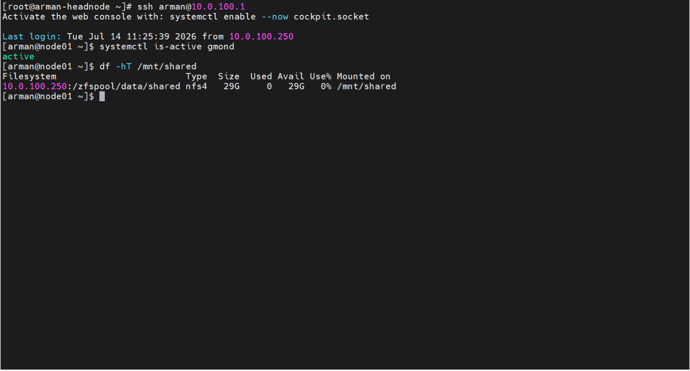
*Abbildung 18: Erfolgreiche SSH-Verbindung zu Node01, aktiver **`gmond`**-Dienst und eingebundener NFSv4-Speicher des Headnodes.*
Ergebnisse:
- SSH vom Headnode zu Node01: erfolgreich
- `gmond`: `active`
- NFS-Quelle: `10.0.100.250:/zfspool/data/shared`
- Mountpoint: `/mnt/shared`
- Dateisystemtyp: `nfs4`
- Verfügbarer Speicher: ungefähr `29 GiB`
### 3.15 Finaler Schreibtest zwischen Node01 und Headnode
Für den abschließenden End-to-End-Test wurde auf Node01 eine Datei im eingebundenen NFS-Verzeichnis erstellt. Anschließend wurde die SSH-Verbindung beendet und dieselbe Datei direkt aus dem ZFS-Pfad des Headnodes gelesen.

*Abbildung 19: Erfolgreicher finaler Schreibtest von Node01 über NFS auf den ZFS-Speicher des Headnodes.*
```bash
# Node01
echo "Cluster-Abschlusstest erfolgreich" > /mnt/shared/cluster-final-test.txt

# Headnode
cat /zfspool/data/shared/cluster-final-test.txt
```
**Ergebnis:** Der vollständige Datenpfad `Node01 → NFS → ZFS auf dem Headnode` funktioniert. Der ausgegebene Inhalt `Cluster-Abschlusstest erfolgreich` bestätigt den erfolgreichen Schreib- und Lesezugriff.
### 3.16 Spack – Installation vorbereiten
Auf dem Headnode wurde nach Abschnitt 13.1 der Anleitung das zentrale Verzeichnis `/home/spack` vorbereitet. Da die Anleitung den Benutzer `spack` voraussetzt, dieser aber noch nicht vorhanden war, wurde der fehlende Systembenutzer mit dem vorgesehenen Home-Verzeichnis ergänzt. Anschließend wurden die benötigten Pakete installiert, das offizielle Spack-Repository geklont, nach `/home/spack/spack` verschoben und vollständig dem Benutzer `spack` zugeordnet.
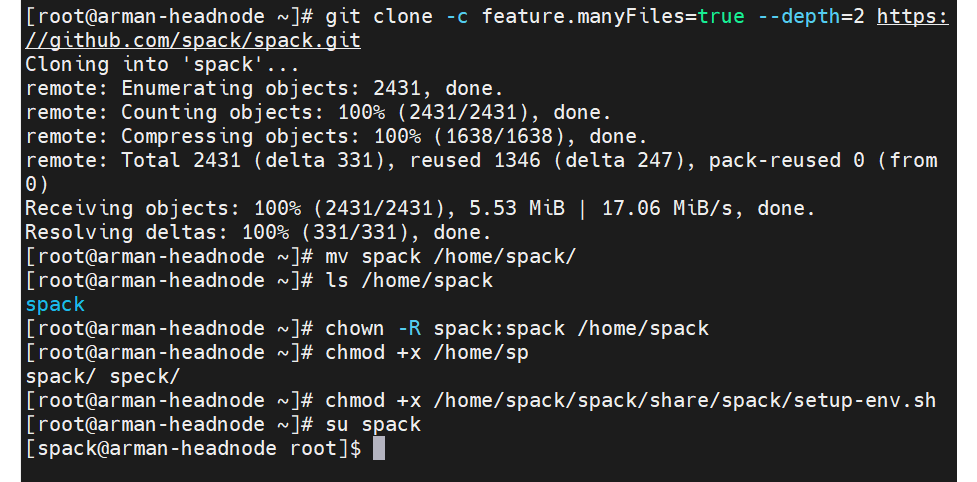
*Abbildung 20: Download des offiziellen Spack-Repositories, Übertragung nach **`/home/spack`**, Vergabe der Eigentümerrechte und erfolgreicher Wechsel zum Benutzer **`spack`**.*
Wichtige Schritte:
```bash
mkdir -p /home/spack
useradd -d /home/spack -s /bin/bash spack
chown spack:spack /home/spack
git clone -c feature.manyFiles=true --depth=2 https://github.com/spack/spack.git
mv spack /home/spack/
chown -R spack:spack /home/spack
chmod +x /home/spack/spack/share/spack/setup-env.sh
su spack
```
### 3.17 Spack – Umgebung aktivieren und Repository reparieren
Die Spack-Umgebung wurde dauerhaft in `/home/spack/.bashrc` eingebunden und in einer neuen Bash-Sitzung geladen. Beim ersten Test war das automatisch verwaltete `builtin`-Paket-Repository unvollständig. Zusätzlich befand sich die mit `su spack` geöffnete Sitzung zunächst noch im nicht zugänglichen Verzeichnis `/root`.
Nach dem Wechsel nach `/home/spack` wurde das unvollständige Repository ohne Datenlöschung in `fncqgg4.incomplete` umbenannt. Beim nächsten Test lud Spack das offizielle Paket-Repository neu herunter.
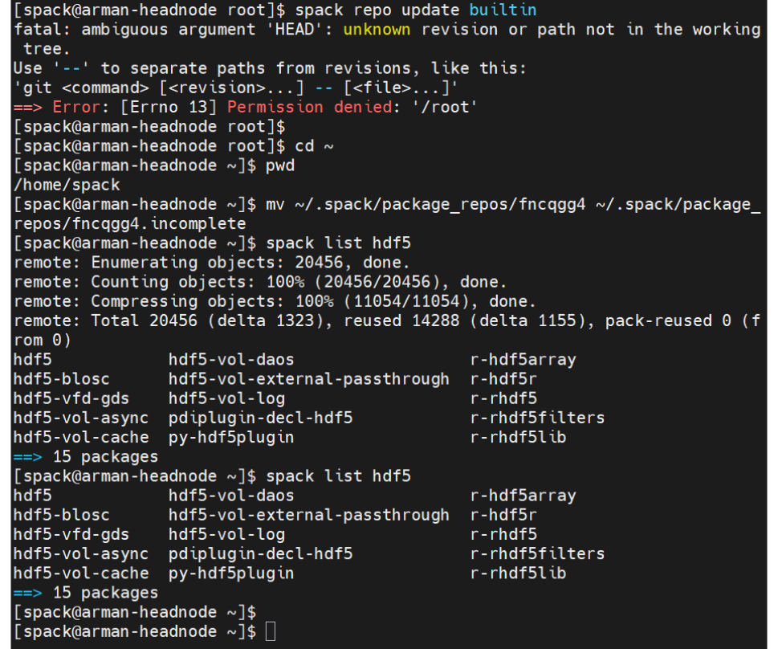
*Abbildung 21: Analyse und Behebung des unvollständigen Spack-Repositories; der abschließende Test findet erfolgreich 15 HDF5-bezogene Pakete.*
Wichtige Kommandos:
```bash
echo ". /home/spack/spack/share/spack/setup-env.sh" >> ~/.bashrc
source ~/.bashrc
exec bash
cd ~
mv ~/.spack/package_repos/fncqgg4 ~/.spack/package_repos/fncqgg4.incomplete
spack list hdf5
```
## 4. Probleme und Lösungen
### Ganglia-Datenquelle nicht erreichbar
**Problem:** `gmetad` lief, meldete aber wiederholt `failed to contact node 10.0.100.250`.
**Ursache:** `gmond` wartete korrekt auf TCP-Port `8649`, aber dieser Port war in der Firewalld-Zone `internal` nicht freigegeben.
**Lösung:** TCP-Port `8649` wurde ausschließlich für das interne Cluster-Netz dauerhaft freigegeben. Nach einem Firewall-Reload und Neustart von `gmetad` wurde die Datenquelle erfolgreich überwacht:
```bash
firewall-cmd --permanent --zone=internal --add-port=8649/tcp
firewall-cmd --reload
systemctl restart gmetad
```
### Fehlende Root-Rechte bei exportfs
**Problem:** `exportfs -rav` konnte die Datei `/var/lib/nfs/etab` nicht sperren und meldete `Permission denied`.
**Ursache:** Der Befehl wurde als normaler Benutzer ausgeführt.
**Lösung:** Ausführung mit Root-Rechten:
```bash
sudo exportfs -rav
```
### Beide Interfaces in der öffentlichen Firewall-Zone
**Problem:** `ens18` und `ens19` verwendeten zunächst beide die Zone `public`.
**Risiko:** Eine pauschale Freigabe von NFS hätte den Dienst auch am externen Interface verfügbar machen können.
**Lösung:** `ens19` wurde der Zone `internal` zugeordnet und die benötigten NFS-Dienste wurden dort freigegeben.
### QEMU Guest Agent auf dem Headnode
Auf dem Headnode fehlen aktuell die erforderlichen VirtIO-Ports. Deshalb kann der QEMU Guest Agent dort noch nicht vollständig aktiviert werden. Dieser Punkt bleibt als späteres To-do bestehen und blockiert die Clusterfunktionen nicht.
## 5. Tests und Ergebnisse
- Rocky Linux 9.8 läuft auf beiden VMs.
- Beide externen IP-Adressen sind erreichbar.
- Das interne Netz `10.0.100.0/24` funktioniert in beide Richtungen.
- SSH vom Headnode zu Node01 funktioniert.
- Der ZFS-Pool ist online und fehlerfrei.
- Der NFS-Dienst ist aktiv.
- Node01 erkennt und mountet die Freigabe.
- Der Mount bleibt durch `/etc/fstab` dauerhaft konfiguriert.
- Der Datei-Schreibtest zwischen Node01 und Headnode war erfolgreich.
## 6. Was ich gelernt habe
- Unterschied zwischen externem und internem Clusternetz
- Statische IPv4-Konfiguration mit NetworkManager
- SSH-Zugriff und Schlüsselverwaltung
- Aufbau und Prüfung eines ZFS-Pools
- Funktionsweise von NFS-Server, Export und Client-Mount
- Bedeutung von `/etc/exports` und `/etc/fstab`
- Trennung von Diensten mit Firewalld-Zonen
- Systematische Prüfung mit Ping, systemctl, df, showmount und Testdateien
- Analyse und Lösung von Berechtigungsproblemen
## 7. Aktueller Stand in der Anleitung
### Abgeschlossen
- Installation und Grundkonfiguration der Systeme
- Proxmox-VMs für Headnode und Node01
- Rocky Linux 9.8
- Externes und internes Netzwerk
- SSH-Verbindung
- ZFS auf dem Headnode
- Abschnitt 9: NFS einschließlich Firewall, dauerhaftem Client-Mount und Funktionstest
### Abgeschlossen: Abschnitt 10 – Ganglia Clustermonitor
Bereits erledigt:
- Ganglia-Pakete auf dem Headnode installiert
- `/etc/ganglia/gmetad.conf` für den Cluster angepasst
- `/etc/ganglia/gmond.conf` für Headnode und internes Netz angepasst
### Aktueller Stand am 14.07.2026
Zusätzlich erledigt:
- Eigentümer von `/var/lib/ganglia/rrds` kontrolliert: `ganglia:ganglia`
- `gmetad` und `gmond` auf dem Headnode gestartet
- Beide Dienste für den automatischen Systemstart aktiviert
- Dienststatus mit `systemctl` kontrolliert
Nächste Schritte:
- Abschnitt 13 „Spack“ als nächsten Schritt beginnen
- Weitere Screenshots und Testergebnisse ergänzen
### 3.18 Anleitungslücke erkannt – SLURM-Benutzer ergänzt
Bei der Spack-Konfiguration sollte mit `slurmctld --v` die installierte SLURM-Version ermittelt werden. Dabei wurde festgestellt, dass SLURM noch nicht installiert war. Abschnitt 8 „SLURM“ der Anleitung war zuvor nicht ausgeführt worden und wird deshalb vor der Fortsetzung von Abschnitt 13 nachgeholt.
Die Anleitung verwendet den Benutzer `slurm`, enthält jedoch keinen Befehl zu seiner Erstellung. Daher wurde der fehlende Benutzer mit dem vorgesehenen Home-Verzeichnis ergänzt und die Eigentümerschaft geprüft.
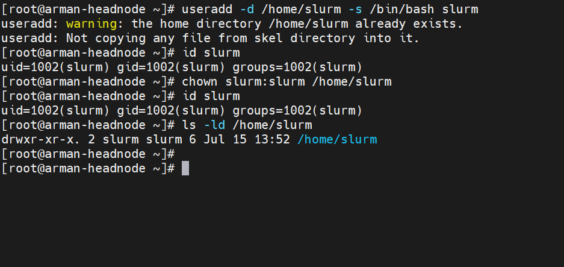
*Abbildung 22: Erstellung des Benutzers **`slurm`**, Vergabe der Eigentümerrechte für **`/home/slurm`** und erfolgreiche Kontrolle von UID, GID und Verzeichnisrechten.*
```bash
mkdir -p /home/slurm
useradd -d /home/slurm -s /bin/bash slurm
chown slurm:slurm /home/slurm
id slurm
ls -ld /home/slurm
```
**Ergebnis:** Der Benutzer `slurm` besitzt UID und GID `1002`. Das Verzeichnis `/home/slurm` gehört korrekt `slurm:slurm`. Die Meldung über das bereits vorhandene Home-Verzeichnis ist unkritisch, weil das Verzeichnis entsprechend der Anleitung zuvor erstellt worden war.

> **Aktueller Fortsetzungspunkt:** Abschnitt 8 „SLURM“ wird nachgeholt. Der SLURM-Benutzer und sein Home-Verzeichnis sind vorbereitet. Als Nächstes werden die „Development Tools“ auf Headnode und Node installiert.

### 3.19 Node01 – CRB-Repository für SLURM-Abhängigkeiten aktiviert
Bei der Installation der für SLURM benötigten Entwicklungspakete konnte `libev-devel` zunächst nicht gefunden werden. Die Kontrolle der aktivierten Paketquellen zeigte, dass das CRB-Repository auf Node01 noch nicht aktiviert war.
Das Repository wurde aktiviert und anschließend kontrolliert:
```bash
sudo dnf config-manager --set-enabled crb
sudo dnf repolist --enabled
```
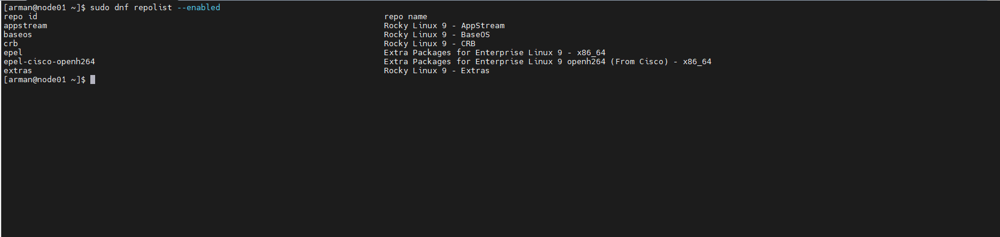
*Abbildung 23: Kontrolle der aktivierten Repositorys auf Node01; das Repository **`crb`** ist erfolgreich aktiviert.*
**Ergebnis:** `crb` wird zusammen mit BaseOS, AppStream, EPEL und Extras als aktive Paketquelle angezeigt. Damit kann die Installation der SLURM-Abhängigkeiten erneut ausgeführt werden.
### 3.20 Node01 – SLURM-Abhängigkeiten erfolgreich installiert
Nach der Aktivierung des CRB-Repositorys wurde die zuvor fehlgeschlagene Paketinstallation auf Node01 erneut ausgeführt:
```bash
sudo dnf -y install libevent-devel libev-devel hwloc-devel dbus-devel
```
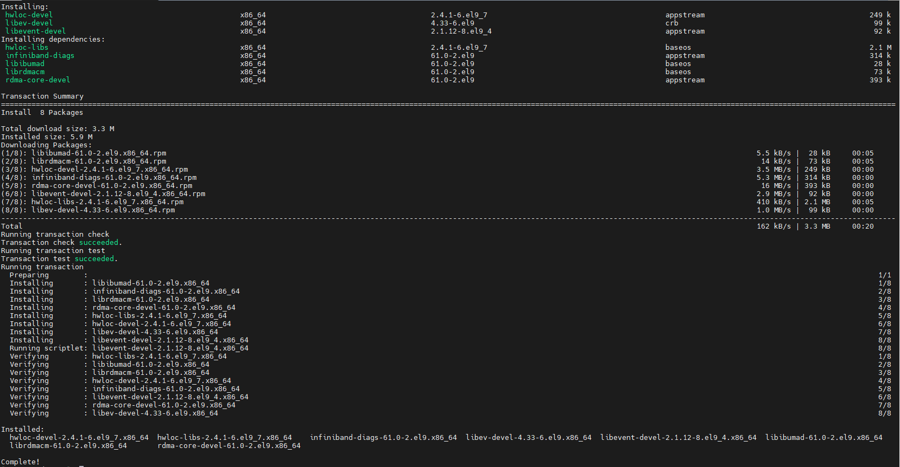
*Abbildung 24: Erfolgreiche Installation der SLURM-Entwicklungsbibliotheken auf Node01; **`libev-devel`** wurde aus dem CRB-Repository bezogen.*
**Ergebnis:** Die Transaktionsprüfung und der Transaktionstest waren erfolgreich. Insgesamt wurden acht Pakete einschließlich der benötigten Abhängigkeiten installiert. Die Installation endete ohne Fehler mit `Complete!`.
### 3.21 Node01 – PMIx- und SLURM-Quellarchive heruntergeladen
Gemäß Abschnitt 8 der Anleitung wurden die vorgesehenen Quellarchive auf Node01 heruntergeladen:
```bash
wget https://github.com/openpmix/openpmix/releases/download/v5.0.7/pmix-5.0.7.tar.gz
wget https://download.schedmd.com/slurm/slurm-25.05.0-0rc1.tar.bz2
```
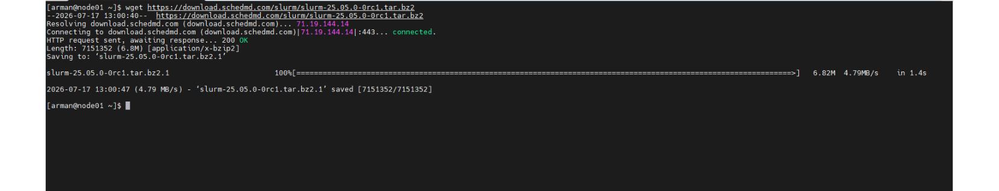
*Abbildung 25: Erfolgreicher Download des SLURM-Quellarchivs auf Node01.*
**Ergebnis:** Die Archive `pmix-5.0.7.tar.gz` und `slurm-25.05.0-0rc1.tar.bz2` wurden vollständig heruntergeladen. Für die Dokumentation wurde der zweite Download des bereits vorhandenen SLURM-Archivs wiederholt. Deshalb speicherte `wget` die zweite Kopie automatisch als `slurm-25.05.0-0rc1.tar.bz2.1`. Das ursprüngliche Archiv mit dem von der Anleitung erwarteten Dateinamen bleibt unverändert vorhanden.
### 3.22 Node01 – PMIx 5.0.7 kompiliert und installiert
Das PMIx-Quellarchiv wurde entpackt. Anschließend wurde die Installation für das Zielverzeichnis `/usr/local/pmix` vorbereitet, kompiliert und mit Root-Rechten installiert:
```bash
tar -xvf pmix-5.0.7.tar.gz
cd pmix-5.0.7
./configure --prefix=/usr/local/pmix
make
sudo make install
```
Die Konfigurationsprüfung erkannte die erforderlichen Bibliotheken HWLOC und Libevent. Danach wurde der Quellcode ohne Fehler kompiliert.
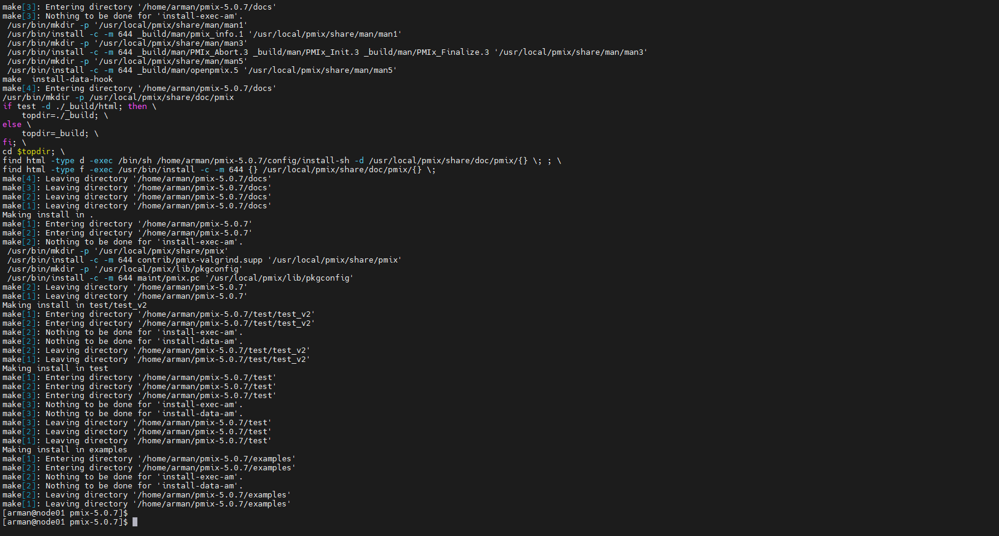
*Abbildung 26: Erfolgreicher Abschluss der PMIx-Installation auf Node01; Bibliotheken, Dokumentation und pkg-config-Datei wurden unter **`/usr/local/pmix`** installiert.*
**Ergebnis:** PMIx 5.0.7 wurde erfolgreich auf Node01 unter `/usr/local/pmix` installiert. Der Installationsvorgang endete ohne Fehlermeldung und kehrte zur Shell-Eingabe zurück.
### 3.23 Node01 – SLURM 25.05.0-0rc1 kompiliert und installiert
Das SLURM-Quellarchiv wurde entpackt und die Konfiguration mit den vorgesehenen Installationspfaden gestartet:
```bash
tar -xvf slurm-25.05.0-0rc1.tar.bz2
cd slurm-25.05.0-0rc1
./configure --prefix=/usr/local/slurm --with-pmix=/usr/local/pmix --with-munge
```
Beim ersten Konfigurationsversuch wurde die MUNGE-Entwicklungsbibliothek nicht gefunden. Zur Fehlerbehebung wurde das fehlende Paket installiert und die Konfiguration anschließend erfolgreich wiederholt:
```bash
sudo dnf -y install munge-devel
./configure --prefix=/usr/local/slurm --with-pmix=/usr/local/pmix --with-munge
```
Danach wurde SLURM kompiliert und mit Root-Rechten installiert:
```bash
make
sudo make install
```
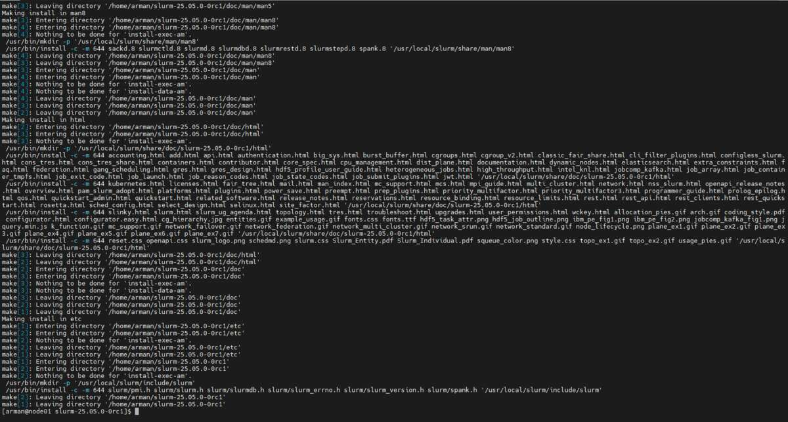
*Abbildung 27: Erfolgreicher Abschluss der SLURM-Installation auf Node01; Programme, Header-Dateien und Dokumentation wurden unter **`/usr/local/slurm`** installiert.*
**Ergebnis:** SLURM 25.05.0-0rc1 wurde mit PMIx- und MUNGE-Unterstützung erfolgreich auf Node01 installiert. Der Installationsvorgang endete ohne Fehlermeldung und kehrte zur Shell-Eingabe zurück.
### 3.24 Headnode – PMIx vorbereitet und SLURM-Quellcode entpackt
Auf dem Headnode wurden die PMIx- und SLURM-Quellarchive heruntergeladen. Beim ersten PMIx-Konfigurationsversuch fehlten die Entwicklungsdateien für Libevent und Libev. Deshalb wurde das CRB-Repository aktiviert und die erforderlichen Pakete nachinstalliert:
```bash
sudo dnf config-manager --set-enabled crb
sudo dnf -y install libevent-devel libev-devel hwloc-devel dbus-devel
```
Anschließend wurde PMIx erneut konfiguriert, kompiliert und unter `/usr/local/pmix` installiert. Danach wurde das SLURM-Archiv entpackt und in das Quellverzeichnis gewechselt:
```bash
./configure --prefix=/usr/local/pmix
make
sudo make install
cd ..
tar -xvf slurm-25.05.0-0rc1.tar.bz2
cd slurm-25.05.0-0rc1
```

*Abbildung 28: Erfolgreiches Entpacken des SLURM-Quellarchivs und Wechsel in das Verzeichnis **`slurm-25.05.0-0rc1`** auf dem Headnode.*
**Ergebnis:** Die PMIx-Voraussetzungen auf dem Headnode wurden ergänzt. PMIx wurde für die anschließende SLURM-Kompilierung bereitgestellt und der SLURM-Quellcode vollständig entpackt.
### 3.25 Headnode – MUNGE-Entwicklungsbibliothek installiert
Für die Kompilierung von SLURM mit MUNGE-Unterstützung wurde auf dem Headnode das erforderliche Entwicklungspaket installiert:
```bash
sudo dnf -y install munge-devel
```
**Ergebnis:** `munge-devel` wurde erfolgreich installiert. Damit stehen die benötigten Header- und Entwicklungsdateien für die anschließende SLURM-Konfiguration mit der Option `--with-munge` zur Verfügung.
### 3.26 Headnode – SLURM-Konfiguration erfolgreich abgeschlossen
SLURM wurde auf dem Headnode mit den vorgesehenen Installationspfaden und der Unterstützung für PMIx und MUNGE konfiguriert:
```bash
./configure --prefix=/usr/local/slurm --with-pmix=/usr/local/pmix --with-munge
```
**Ergebnis:** `configure` wurde ohne Fehlermeldung abgeschlossen. Die erforderlichen Makefiles, Header- und Konfigurationsdateien wurden erstellt. Der SLURM-Quellcode ist damit für die Kompilierung auf dem Headnode vorbereitet.
### 3.27 Headnode – SLURM erfolgreich kompiliert
Der vorbereitete SLURM-Quellcode wurde auf dem Headnode kompiliert:
```bash
make
```
Während des Build-Vorgangs wurden unter anderem die Programme, Bibliotheken sowie die systemd-Service-Dateien für `slurmctld`, `slurmd`, `slurmdbd` und `slurmrestd` erzeugt.
**Ergebnis:** Die Kompilierung wurde ohne Fehlermeldung abgeschlossen. Alle Make-Prozesse verließen ihre Verzeichnisse ordnungsgemäß und kehrten zur Shell-Eingabe zurück. SLURM ist nun bereit für die Installation unter `/usr/local/slurm`.
### 3.28 Headnode – SLURM erfolgreich installiert
Die kompilierten SLURM-Dateien wurden mit Administratorrechten in das vorgesehene Zielverzeichnis installiert:
```bash
sudo make install
```
Dabei wurden Programme, Bibliotheken, Header-Dateien und Dokumentation unter `/usr/local/slurm` abgelegt.
**Ergebnis:** Die Installation wurde ohne Fehlermeldung abgeschlossen. SLURM 25.05.0-0rc1 ist damit auf dem Headnode installiert.
### 3.29 Headnode – SLURM-Verzeichnisse und Logdateien angelegt
Gemäß Abschnitt 8.1 der Anleitung wurden auf dem Headnode die benötigten Konfigurations-, Spool- und Logpfade vorbereitet:
```bash
sudo mkdir /etc/slurm
sudo touch /var/log/slurm.log
sudo touch /var/log/SlurmctldLogFile.log
sudo touch /var/log/SlurmdLogFile.log
sudo mkdir /var/spool/slurmctld
sudo mkdir /usr/local/slurm/etc
sudo chown slurm:slurm /var/spool/slurmctld
sudo chmod 755 /var/spool/slurmctld
sudo touch /var/log/slurmctld.log
sudo chown slurm:slurm /var/log/slurmctld.log
sudo touch /var/log/slurm_jobacct.log
sudo chown slurm:slurm /var/log/slurm_jobacct.log
```
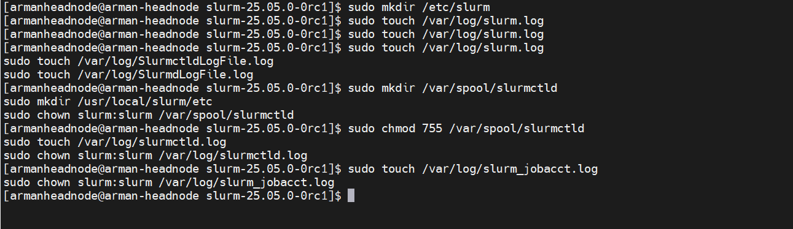
*Abbildung 29: Erfolgreiche Erstellung der SLURM-Verzeichnisse und Logdateien auf dem Headnode.*
**Ergebnis:** Alle Befehle wurden ohne Fehlermeldung ausgeführt. Das Spool-Verzeichnis `/var/spool/slurmctld` besitzt den Eigentümer `slurm:slurm` und die Berechtigung `755`. Die benötigten Logdateien wurden angelegt.
### 3.30 Node01 – SLURM-Verzeichnisse vorbereitet und fehlenden Service-Benutzer ergänzt
Gemäß Abschnitt 8.2 der Anleitung wurden auf Node01 die benötigten Verzeichnisse und Logdateien vorbereitet:
```bash
sudo mkdir -p /etc/slurm
sudo touch /var/log/slurm.log /var/log/SlurmctldLogFile.log /var/log/SlurmdLogFile.log
sudo mkdir /var/spool/slurmd
```
Beim Setzen des Eigentümers trat folgender Fehler auf:
```plain text
chown: invalid user: ‘slurm:slurm’
```
Die Ursache war ein fehlender lokaler Service-Benutzer `slurm` auf Node01. Zur Wahrung identischer Dateirechte im Cluster wurden zunächst UID und GID des Benutzers auf dem Headnode ermittelt:
```plain text
uid=1002(slurm) gid=1002(slurm) groups=1002(slurm)
```
Nach der Kontrolle, dass UID und GID `1002` auf Node01 noch frei waren, wurden Group und User mit denselben IDs erstellt:
```bash
sudo groupadd -g 1002 slurm
sudo useradd -u 1002 -g 1002 -d /home/slurm -m slurm
```
Anschließend wurden Eigentümer und Berechtigungen des Spool-Verzeichnisses erfolgreich gesetzt und geprüft:
```bash
sudo chown slurm:slurm /var/spool/slurmd
sudo chmod 755 /var/spool/slurmd
ls -ld /var/spool/slurmd
```
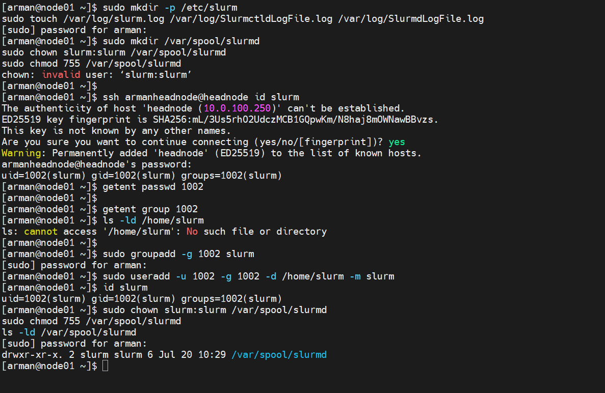
*Abbildung 30: Fehleranalyse, Erstellung des SLURM-Service-Benutzers mit identischer UID/GID und erfolgreiche Prüfung des Spool-Verzeichnisses auf Node01.*
**Ergebnis:** Der Benutzer und die Gruppe `slurm` besitzen auf Headnode und Node01 einheitlich UID/GID `1002`. Das Verzeichnis `/var/spool/slurmd` gehört `slurm:slurm` und besitzt die Berechtigung `755`. Abschnitt 8.2 der Anleitung ist damit abgeschlossen.
### 3.31 SLURM-Hauptkonfiguration auf dem Headnode erstellt
Der in der Anleitung genannte Online-Konfigurator unterstützt inzwischen ausschließlich SLURM 26.05. Da im Projekt SLURM 25.05.0-0rc1 eingesetzt wird, wurde die Konfigurationsdatei passend zur installierten Version und zur tatsächlichen Cluster-Hardware manuell erstellt.
Zuvor wurden der kurze und vollständige Hostname des Headnodes sowie die von `slurmd -C` erkannte Hardwarekonfiguration von Node01 ermittelt:
```plain text
arman-headnode
arman-headnode.zarm.uni-bremen.de
NodeName=node01 CPUs=2 Boards=1 SocketsPerBoard=1 CoresPerSocket=2 ThreadsPerCore=1 RealMemory=3655
```
Die Datei `/etc/slurm/slurm.conf` enthält unter anderem:
- Clustername: `arman-cluster`
- Controller: `arman-headnode` über die interne IP `10.0.100.250`
- Compute Node: `node01` über `10.0.100.1`
- Authentifizierung: MUNGE
- MPI-Schnittstelle: PMIx
- Scheduler: Backfill
- Ressourcenauswahl: CPU-Kerne und Arbeitsspeicher
- Prozess- und Task-Verfolgung: cgroup
- Partition: `debug`
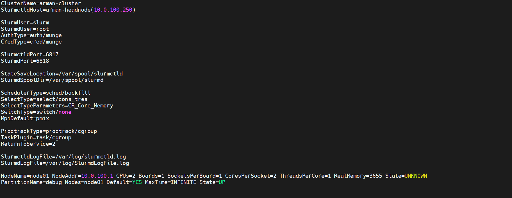
*Abbildung 31: Inhalt der auf den Cluster zugeschnittenen Datei **`slurm.conf`**.*
Anschließend wurden Eigentümer und Zugriffsrechte gesetzt:
```bash
sudo chown root:root /etc/slurm/slurm.conf
sudo chmod 644 /etc/slurm/slurm.conf
sudo ls -l /etc/slurm/slurm.conf
```
Ein zunächst unvollständig eingegebener `chmod`-Befehl wurde von Linux mit „missing operand“ abgewiesen und danach korrekt mit dem Modus `644` wiederholt.
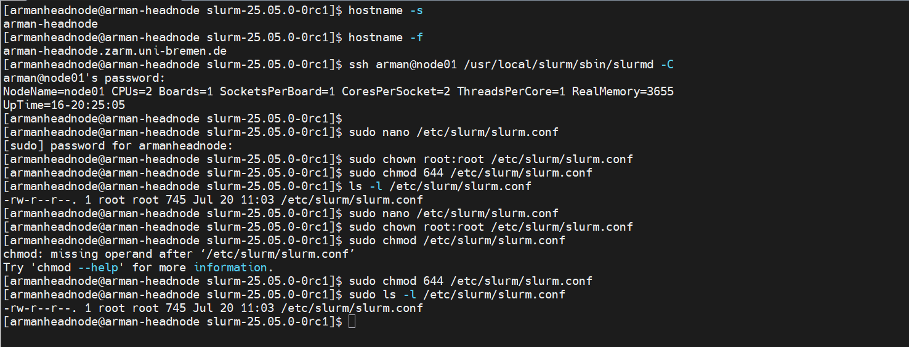
*Abbildung 32: Ermittlung der Systemdaten sowie erfolgreiche Prüfung von Eigentümer und Berechtigung der Datei **`slurm.conf`**.*
**Ergebnis:** `slurm.conf` ist auf dem Headnode vorhanden, gehört `root:root` und besitzt die Berechtigung `-rw-r--r--` beziehungsweise `644`.
### 3.32 SLURM-Konfiguration auf Node01 verteilt und System-PATH ergänzt
Die zentrale Datei `slurm.conf` wurde zunächst per SCP in ein temporäres Verzeichnis auf Node01 übertragen und anschließend mit Administratorrechten an den endgültigen Speicherort verschoben:
```bash
scp /etc/slurm/slurm.conf arman@node01:/tmp/slurm.conf
sudo mv /tmp/slurm.conf /etc/slurm/slurm.conf
sudo chown root:root /etc/slurm/slurm.conf
sudo chmod 644 /etc/slurm/slurm.conf
```
Damit verwenden Headnode und Node01 dieselbe Clusterkonfiguration.
Anschließend wurde auf Node01 in `/etc/environment` der systemweite Suchpfad um die SLURM-Verzeichnisse ergänzt:
```plain text
PATH="/usr/local/slurm/bin:/usr/local/slurm/sbin:/usr/local/sbin:/usr/local/bin:/usr/sbin:/usr/bin:/sbin:/bin:/usr/libexec"
```
**Ergebnis:** Die Konfigurationsdatei liegt auf Node01 unter `/etc/slurm/slurm.conf` mit Eigentümer `root:root` und Berechtigung `644`. Nach einer neuen Anmeldung können SLURM-Kommandos ohne vollständige Pfadangabe aufgerufen werden.
### 3.33 cgroup v2 geprüft und SLURM-cgroup-Konfiguration verteilt
Nach der Aktualisierung des systemweiten PATH wurde geprüft, ob Headnode und Node01 cgroup v2 verwenden:
```bash
stat -fc %T /sys/fs/cgroup/
ssh arman@node01 'stat -fc %T /sys/fs/cgroup/'
```
Beide Systeme lieferten:
```plain text
cgroup2fs
```
Damit ist cgroup v2 auf beiden Cluster-Systemen aktiv. Auf dem Headnode wurde anschließend die Datei `/etc/slurm/cgroup.conf` mit folgenden Ressourcenbegrenzungen erstellt:
```plain text
ConstrainCores=yes
ConstrainRAMSpace=yes
ConstrainDevices=yes
CgroupMountpoint=/sys/fs/cgroup
```
Die Datei wurde per SCP nach Node01 übertragen und dort mit Eigentümer `root:root` sowie Berechtigung `644` abgelegt.
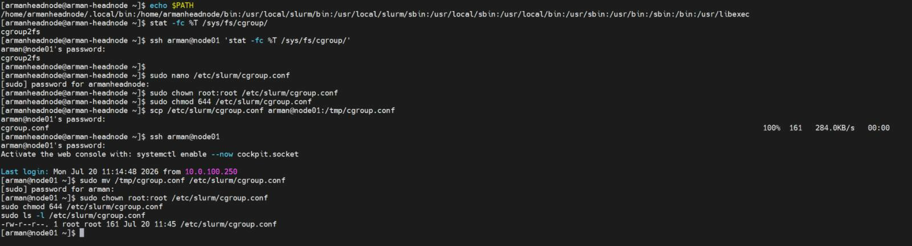
*Abbildung 33: Erfolgreiche cgroup-v2-Prüfung auf beiden Systemen, Übertragung der cgroup-Konfiguration und Kontrolle der Dateirechte auf Node01.*
**Ergebnis:** Headnode und Node01 verwenden cgroup v2 und besitzen eine identische `cgroup.conf`. SLURM kann damit CPU-Kerne, Arbeitsspeicher und Geräte für Jobs kontrollieren.
### 3.34 MUNGE aktiviert und zwischen den Cluster-Knoten getestet
MUNGE wurde auf Headnode und Node01 aktiviert und für den automatischen Systemstart eingerichtet. Die SHA-256-Prüfsummen der Datei `/etc/munge/munge.key` waren auf beiden Systemen identisch:
```plain text
89bc95963b9163d73bcb02977cd986da7afab8b2e329203b7b1c1403ea7a621f
```
Die lokale Prüfung mit `munge -n | unmunge` sowie der systemübergreifende Test von Node01 zum Headnode waren erfolgreich. Der Belastungstest `remunge` auf Node01 verarbeitete 9281 Credentials mit ungefähr 9275 Credentials pro Sekunde.
**Ergebnis:** Die MUNGE-Authentifizierung funktioniert lokal und zwischen Headnode und Node01.
### 3.35 SLURM-Controller auf dem Headnode aktiviert
Der zentrale SLURM-Dienst wurde auf dem Headnode gestartet und für den automatischen Systemstart aktiviert:
```bash
sudo systemctl enable --now slurmctld
sudo systemctl is-active slurmctld
```
Die Aktivierung erstellte den erforderlichen systemd-Link. Die Statusprüfung lieferte `active`.
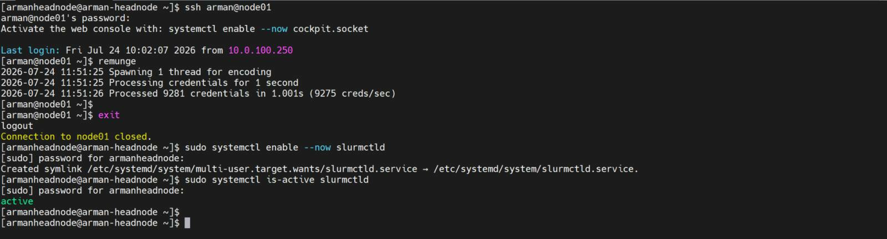
*Abbildung 34: Erfolgreicher MUNGE-Belastungstest auf Node01 sowie aktivierter SLURM-Controller **`slurmctld`** auf dem Headnode.*
**Ergebnis:** Der SLURM-Controller `slurmctld` läuft auf dem Headnode.
### 3.36 SLURM-Daemon auf Node01 aktiviert – SELinux-Kontext korrigiert
Der erste Aktivierungsversuch schlug trotz vorhandener Datei `/etc/systemd/system/slurmd.service` mit folgender Meldung fehl:
```plain text
Failed to enable unit: Unit file slurmd.service does not exist.
```
Die Service-Datei war vollständig und syntaktisch gültig, besaß jedoch den falschen SELinux-Kontext `user_tmp_t`. Dadurch wurde sie weiterhin als temporäre Datei behandelt. Der Kontext wurde korrigiert:
```bash
sudo restorecon -v /etc/systemd/system/slurmd.service
sudo systemctl daemon-reload
sudo systemctl enable --now slurmd
sudo systemctl is-active slurmd
```
Nach `restorecon` hatte die Datei den korrekten Kontext `systemd_unit_file_t`. Anschließend wurde der systemd-Link erfolgreich erstellt und die Statusprüfung lieferte `active`.
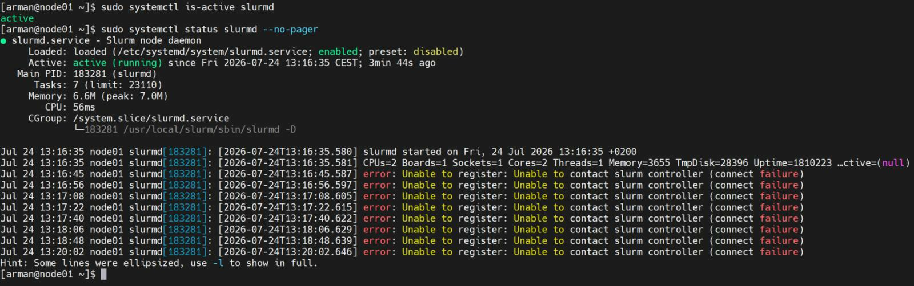
*Abbildung 35: **`slurmd`** ist auf Node01 aktiviert und läuft, kann den SLURM-Controller jedoch noch nicht erreichen.*
**Zwischenergebnis:** `slurmd` läuft auf Node01, meldet aber wiederholt `Unable to contact slurm controller (connect failure)`. Die Verbindung zum Controller wird als nächster Schritt geprüft.
### 3.37 SLURM-Kommunikation und Firewall geprüft
Die Ursache der fehlenden Registrierung war eine blockierte Verbindung zwischen den SLURM-Diensten. Auf dem Headnode wurde `6817/tcp` für `slurmctld` in der Zone `internal` freigegeben. Auf Node01 wurde `ens19` von `public` nach `internal` verschoben und `6818/tcp` für `slurmd` freigegeben.
Die Verbindungen wurden in beiden Richtungen erfolgreich geprüft:
```bash
nc -vz 10.0.100.250 6817
nc -vz 10.0.100.1 6818
```
Danach wurde Node01 mit folgendem Kommando aus dem Zustand `DOWN` zurückgesetzt:
```bash
sudo /usr/local/slurm/bin/scontrol update NodeName=node01 State=RESUME
```
`sinfo -N -l` zeigte anschließend den Zustand `idle`. Der erste Testjob wurde dem Node zugeteilt:
```bash
srun -N 1 -n 1 hostname
```
Der Job erreichte Node01, konnte seine Ein-/Ausgabe-Verbindung jedoch nicht zum Headnode zurückbauen. Das Slurmd-Log meldete `connect io: No route to host`. In `slurm.conf` ist noch kein `SrunPortRange` definiert. Als nächster Schritt wird ein fester Portbereich für `srun` konfiguriert und ausschließlich im internen Firewall-Netz freigegeben.
**Aktueller Stand:** Controller und Compute Node kommunizieren über `6817/tcp` und `6818/tcp`. Node01 steht auf `idle`.
### 3.38 Srun-I/O-Portbereich konfiguriert und Jobtest erfolgreich
Vor der Änderung wurden Sicherungskopien von `/etc/slurm/slurm.conf` auf Headnode und Node01 erstellt. Danach wurde auf beiden Systemen folgende Einstellung ergänzt:
```plain text
SrunPortRange=60001-63000
```
Auf dem Headnode wurde derselbe TCP-Bereich ausschließlich in der Firewall-Zone `internal` freigegeben. Nach `firewall-cmd --reload` und `scontrol reconfigure` bestätigte `scontrol show config` den geladenen Portbereich.
Der interaktive Testjob wurde anschließend erfolgreich ausgeführt:
```bash
srun -N 1 -n 1 hostname
```
Ausgabe:
```plain text
node01
```
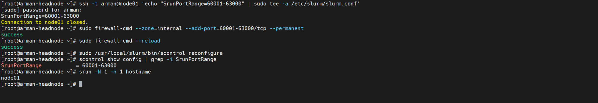
*Abbildung 36: Konfiguration des Srun-Portbereichs, interne Firewall-Freigabe und erfolgreicher SLURM-Jobtest auf Node01.*
**Ergebnis:** Die vollständige SLURM-Kommunikationskette funktioniert. Der Headnode plant den Job, Node01 führt ihn aus und die Standardausgabe wird erfolgreich an `srun` auf dem Headnode zurückgegeben.
### 3.39 Spack Abschnitt 13.1 geprüft und SLURM als External registriert
Nach Abschluss der SLURM-Konfiguration wurde die Arbeit gemäß Anleitung in Abschnitt 13.1 fortgesetzt. Der Benutzer `spack`, das Home-Verzeichnis `/home/spack`, das geklonte Repository und die Aktivierung über `setup-env.sh` waren bereits vorhanden und korrekt konfiguriert.
Die Spack-Funktion wurde erfolgreich geprüft:
```bash
spack list hdf5
```
Spack fand 15 passende Pakete.
Die Datei `/home/spack/.spack/packages.yaml` existierte bereits, enthielt jedoch keinen Eintrag für die manuell installierte SLURM-Version. Nach einer Sicherung der Datei wurde folgender External-Eintrag ergänzt:
```yaml
slurm:
  externals:
  - spec: slurm@25.05.0-0rc1
    prefix: /usr/local/slurm
  buildable: false
```
Der Test `spack spec slurm` zeigte `[e] slurm@25.05.0-0rc1`. Das Kennzeichen `[e]` bestätigt, dass Spack die vorhandene SLURM-Installation als External verwendet und nicht erneut baut. Beim ersten Concretizer-Lauf wurde zusätzlich `clingo-bootstrap` aus einem Buildcache bereitgestellt.
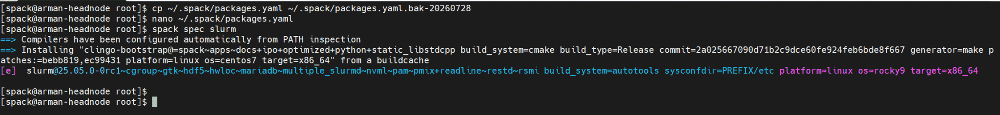
*Abbildung 37: Sicherung und Anpassung von packages.yaml sowie erfolgreiche Erkennung von SLURM als externes Spack-Paket.*
**Ergebnis:** Abschnitt 13.1 ist abgeschlossen. Als nächster Schritt folgt Abschnitt 13.2.1 mit der Prüfung und Installation einer GCC-Version über Spack.
### 3.40 Verfügbare GCC-Versionen in Spack geprüft
Auf dem Headnode wurde als Benutzer `spack` folgender Befehl ausgeführt:
```bash
spack versions gcc
```
Spack zeigte die bereits geprüften und mit Prüfsummen hinterlegten GCC-Versionen an. Die Ausgabe reichte von älteren Versionen bis `16.1.0`. Der Platzhalter `[version]` aus der Anleitung wird für dieses Projekt durch die stabile, ausgereifte Version `13.4.0` ersetzt. Die Prüfung mit `df -h /home/spack` zeigte `18 GiB` freien Speicher. Dieser Platz reicht voraussichtlich für Build und Installation aus, wird danach aber erneut kontrolliert.
Der erste Installationsversuch mit `spack install -j 2 gcc@13.4.0` brach bei `compiler-wrapper` und `autoconf-archive` mit `PermissionError: /root` ab. Ursache war das aktuelle Arbeitsverzeichnis `/root`.
### 3.41 GCC-Aufruf aus /home/spack wiederholt — Prüfung läuft
Der Befehl wurde anschließend als Benutzer `spack` aus dem Home-Verzeichnis wiederholt:
```bash
spack install -j 2 gcc@13.4.0
```
Ausgabe:
```plain text
[e] f6qycsc gcc@13.4.0 /home/spack/spack/opt/spack/linux-x86_64_v2/gcc-13.4.0-avwozlzdpfe6zvekcnefo2gifmbqprf2 (0s)
```
Die frühere Berechtigungsstörung trat nicht erneut auf. Da Spack `[e]` statt `[+]` meldet und der Vorgang nur `0s` dauerte, bleibt der Schritt **in Prüfung**.
### 3.42 Screenshot geprüft: zwei GCC-Specs und mehrdeutige Abfrage
Der vollständige Terminal-Screenshot vom 07.08.2026 zeigt:
- `spack find -lv gcc@13.4.0` findet zwei Specs: `f6qycsc` für External GCC und `avwozlz` für den tatsächlich mit GCC 11.5.0 gebauten `x86_64_v2`-Spec.
- `spack location -i gcc@13.4.0` bricht mit `matches multiple packages` ab.
- Weil `gcc_prefix` danach leer war, wurde mit `"$gcc_prefix/bin/gcc" --version` unbeabsichtigt `/bin/gcc` ausgeführt. Die Ausgabe GCC 11.5.0 bestätigt daher nur den System-Compiler.
- `df -h /home/spack` zeigt `17G` frei bei `40%` Belegung.
- `spack compilers` enthält bereits `[+] gcc@13.4.0`.
**Bewertung:** Die Diagnose erklärt die Ausgabe, gehört aber nicht zum vorgeschriebenen Ablauf der Anleitung und wird nicht weiter vertieft.
### 3.43 Rückkehr zum dokumentierten Ablauf
Die Originalanleitung wurde auf den Seiten 18 bis 20 visuell und inhaltlich geprüft. Für Abschnitt 13.2.1 ist die Reihenfolge:
1. `spack versions gcc` — durchgeführt
2. `spack install gcc@13.4.0` — durchgeführt
3. `spack load gcc@13.4.0` — aktueller Schritt
Der im PDF durchgestrichene Befehl `spack compiler remove` wird nicht ausgeführt. Erst nach einem erfolgreichen `spack load` wird mit Abschnitt 13.2.2 und `spack versions openmpi` fortgefahren.
### 3.44 Dokumentierter Load-Befehl war wegen zwei Specs mehrdeutig
Ausgabe von `spack load gcc@13.4.0`:
```plain text
==> Error: gcc@13.4.0 matches multiple packages.
Matching packages:
  avwozlz gcc@13.4.0 platform=linux os=rocky9 target=x86_64_v2 %c,cxx=gcc@11.5.0
  f6qycsc gcc@13.4.0 platform=linux os=rocky9 target=x86_64
Use a more specific spec (e.g., prepend '/' to the hash).
```
Die Anleitung nutzt auf derselben Seite bei mehrdeutigen Spack-Abhängigkeiten die Auswahl über `/[Hash-Wert]`. Der zuvor bestätigte installierte GCC-Spec trägt Hash `avwozlz` und den Status `[+]`. Daher lautet die minimale Fortsetzung des Load-Schritts:
```bash
spack load /avwozlz
```
Der Screenshot zeigt, dass `spack load /avwozlz` ohne Ausgabe oder Fehler beendet wurde und der Prompt `[spack@arman-headnode ~]$` zurückkehrte. Damit ist der Load-Schritt erfolgreich und Abschnitt 13.2.1 **abgeschlossen**.
### 3.45 Abschnitt 13.2.2 OpenMPI begonnen
Der erste in der Anleitung vorgegebene Befehl lautet:
```bash
spack versions openmpi
```
Mit diesem Schritt werden zunächst ausschließlich die in Spack verfügbaren OpenMPI-Versionen angezeigt; eine Installation erfolgt noch nicht.
Die Ausgabe enthält als höchste nummerierte und bereits checksummierte Version `5.0.10`. `main` wird nicht verwendet, da es kein festes Release ist.
**Versionsentscheidung:** OpenMPI `5.0.10`.
Gemäß Hinweis der Anleitung werden bei OpenMPI 5 die Optionen `+pmix schedulers=slurm` weggelassen. Der nächste Befehl lautet:
```bash
spack install openmpi@5.0.10%gcc@13.4.0
```
Der Screenshot zeigt die vollständige Installation mit:
```plain text
[+] wuhedqo openmpi@5.0.10 /home/spack/spack/opt/spack/linux-x86_64_v2/openmpi-5.0.10-wuhedqoyg6lz2maijh4bjsntbnxrswkz (5m57s)
```
Die Installation ist damit **erfolgreich abgeschlossen**. Der nächste dokumentierte Befehl lautete:
```bash
spack load openmpi@5.0.10
```
Der Screenshot bestätigt die fehlerfreie Ausführung und Rückkehr des Prompts. Abschnitt 13.2.2 ist damit **abgeschlossen**.
### 3.46 Abschnitt 13.2.3 openFOAM begonnen
Die Anleitung fordert zuerst, den Hashwert der installierten OpenMPI-Instanz zu ermitteln:
```bash
spack find -l openmpi
```
Die Ausgabe lautet:
```plain text
wuhedqo openmpi@5.0.10
==> 1 installed package
```
Damit gilt:
```bash
HASH_WERT=wuhedqo
```
Die ebenfalls in diesem Absatz stehende Zeile `spack find -l openfoam@[version]` kann vor Auswahl und Installation einer openFOAM-Version keinen passenden installierten Spec liefern. Sie wird als Dokumentationsfehler in der Reihenfolge vermerkt und nicht als unnötiger Suchlauf ausgeführt.
Der nächste gültige Schritt der Anleitung war:
```bash
spack versions openfoam
```
Die Ausgabe zeigt als neueste nummerierte Safe-Version `2512`. `develop` und `master` werden nicht verwendet, da sie keine festen Releases sind.
**Versionsentscheidung:** openFOAM `2512`.
Da OpenMPI `5.0.10` verwendet wird, entfällt laut Anleitung `schedulers=slurm`. Der Installationsbefehl lautet:
```bash
spack install openfoam@2512%gcc@13.4.0^/${HASH_WERT}
```
Der Status bleibt bis zur vollständigen Installationsausgabe **in Bearbeitung**.
### 3.47 Übernahme (21.08.2026) – Phase A: Bestandsaufnahme
Vor jeder Änderung wurde der aktuelle Zustand ausschließlich lesend überprüft (keine Pakete gelöscht, kein Rebuild gestartet), gemäß der im Handoff-Dokument empfohlenen Übernahmereihenfolge.
**Spack-Version:**
```bash
spack --version
```
```plain text
1.2.0 (63962ed90680d339004305075da272ae93c04a41)
```
Der zuvor dokumentierte Zwischenstand `v1.2.0` ist weiterhin aktuell.
**Installierte Pakete unverändert:**
```bash
spack find -lv gcc openmpi openfoam
```
Bestätigt: GCC-Hash `avwozlz`, OpenMPI-Hash `wuhedqo`, OpenFOAM-Hash `m7gklin` — identisch mit dem letzten dokumentierten Stand vom 10.–11.08.2026. Keine Drift seit der letzten Dokumentation.
**SLURM-Pfadabweichung geklärt:**
```bash
grep -A 8 -B 2 'slurm:' /home/spack/.spack/packages.yaml
```
`packages.yaml` enthält aktuell nur einen einzigen Eintrag mit Prefix `/usr/local/slurm`. Zusätzliche Prüfung:
```bash
ls -la /usr/local/slurm /apps/slurm/25.05.0-0rc1
command -v srun
readlink -f $(command -v srun)
```
`/apps/slurm/25.05.0-0rc1` existiert nicht auf der Festplatte (`No such file or directory`). `srun` in PATH löst zu `/usr/local/slurm/bin/srun` auf.
**Ergebnis: Die kritische Pfadabweichung ist aufgelöst.** `/usr/local/slurm` ist der einzige reale und aktiv genutzte Prefix, konsistent zwischen `packages.yaml`, PATH und installierter Struktur. Kriterium „Prefix reale SLURM in Services und Spack identisch dokumentiert“ ist damit erfüllt.
**Neuer Befund – NFS-Home-Problem bei srun:**
```bash
systemctl is-active slurmctld
sinfo -N -l
srun -N 1 -n 1 hostname
```
`slurmctld` aktiv, Node01 `idle`, Jobausgabe weiterhin korrekt (`node01`), aber mit neuer Warnung:
```plain text
error: couldn't chdir to `/home/spack': No such file or directory: going to /tmp instead
```
Ursache: `/home` wird nicht per NFS auf Node01 bereitgestellt (nur `/zfspool/data/shared` → `/mnt/shared`). **Für den späteren SLURM-Case-Test muss das Arbeitsverzeichnis daher zwingend unter ****`/mnt/shared`**** liegen, nicht unter ****`/home/spack`****.**
**ZFS/Storage unverändert:**
```bash
df -hT /zfspool/data/shared
```
29G frei, 128K belegt, 1% Auslastung — konsistent mit der letzten Dokumentation.
### 3.48 OpenFOAM-Diagnose – Ursache endgültig bestätigt
```bash
foam_dir="$(spack location -i /m7gklin)"
ls -la "$foam_dir/platforms/linux64GccDPInt32-spack/bin"
ls -la "$foam_dir/platforms/linux64GccDPInt32-spack/lib"
```
Ergebnis: Beide Verzeichnisse sind **vollständig leer** (`total 0`, nur `.` und `..`). Zusätzlich wurde festgestellt, dass der komplette Source-Baum (`applications`, `src`, `tutorials`, `wmake`) unverändert in den Installationsprefix kopiert wurde.
**Interpretation:** Damit ist zweifelsfrei bestätigt, dass es sich nicht um ein PATH-Problem handelt, sondern dass der `Allwmake`-Build-Schritt nie erfolgreich Binaries oder Bibliotheken erzeugt hat.
**Rezept-Fundort:**
```bash
spack repo list
find /home/spack/spack -type f -iname "package.py" -path "*openfoam*"
```
- Aktiver Repo: `builtin` (v2.2) unter `/home/spack/.spack/package_repos/fncqgg4/repos/spack_repo/builtin`
- Live-editierbares Rezept: `/home/spack/.spack/package_repos/fncqgg4/repos/spack_repo/builtin/packages/openfoam/package.py`
- Archivierte Kopie im Installationsprefix (read-only, Stand des letzten Builds): `.../openfoam-2512-m7gklin.../.spack/repos/spack_repo/builtin/packages/openfoam/package.py`
**Status:** Phase A abgeschlossen, keine unerwartete Drift außer den zwei oben dokumentierten neuen Befunden. Root Cause für den OpenFOAM-Blocker bestätigt: `Allwmake` erzeugt keine Solver-Binaries. Weiter mit Phase C (Rezept-Diff und gezielter Rebuild).
### 3.49 Phase C – Root Cause im vorhandenen Build-Log gefunden
Statt sofort neu zu bauen, wurde zuerst das vorhandene, komprimierte Build-Log der letzten Installation ausgewertet (kein Rebuild, keine Änderung):
```bash
find "$foam_dir/.spack" -iname "*build-out*" -o -iname "*build-env*"
zgrep -n -i -E "error|unknown|Allwmake|WM_PROJECT_DIR|fail" "$foam_dir/.spack/spack-build-out.txt.gz" | head -n 60
```
**Relevante Zeilen aus dem Log (Installation vom 11.08.2026, 13:53 Uhr):**
```plain text
25: ==> [...] ./spack-Allwmake -silent -j2
27: WM_PROJECT_DIR = /tmp/spack/spack-stage/spack-stage-openfoam-2512-.../spack-src
38: compiler=unknown
43: Starting compile spack-src Allwmake
48: make: *** internal error: invalid --jobserver-auth string 'fifo:/tmp/tmpl29hxp81/jobserver_fifo'.  Stop.
53:     ignoring possible compilation errors
```
**Analyse:**
- Zeile 27 (`WM_PROJECT_DIR` zeigt korrekt auf das Stage-/Source-Verzeichnis, nicht auf den Install-Prefix) ist **unauffällig** — entspricht dem erwarteten Verhalten während des Builds.
- Zeile 38 (`compiler=unknown`) ist vermutlich nur eine frühe Platzhalter-Ausgabe vor der eigentlichen Compiler-Erkennung und nicht die eigentliche Fehlerursache. Ein direkter Python-Test bestätigte, dass `spec.compiler` in der aktuellen Spack-Version (`v1.2.0`) funktionsfähig ist und korrekt `gcc@13.4.0` zurückgibt:
```bash
spack python -c "import spack.store; s = spack.store.STORE.db.query('/m7gklin')[0]; print(s.compiler)"
```
```plain text
gcc@13.4.0/f6qycsceim7t62iyrukfu4mrz6pvt7a6
```
- **Der eigentliche Fehler ist Zeile 48:** Weil der Build mit `-j2` (parallel) gestartet wurde, versuchte GNU Make einen Jobserver über eine benannte Pipe (`fifo:/tmp/tmpl29hxp81/jobserver_fifo`) zu initialisieren. Diese Authentifizierung war ungültig, wodurch **jeder Sub-****`make`****-Aufruf innerhalb von ****`Allwmake`**** sofort mit "Stop." abbrach** — es wurde de facto nichts kompiliert.
- Der Wrapper `spack-Allwmake` fängt diesen Fehler ab (`ignoring possible compilation errors`, Zeile 53) und lässt die Installation trotzdem als erfolgreich durchlaufen. Dadurch kopiert die anschließende `install()`-Phase nur die (leeren) `platforms`-Verzeichnisse.
**Root Cause (bestätigt):** Ein GNU-Make-Jobserver-Fehler bei parallelem Build (`-j2`) lässt `Allwmake` sofort abbrechen, wird aber vom Recipe-Wrapper stillschweigend ignoriert, sodass Spack die Installation fälschlich als erfolgreich meldet.
**Nächster geplanter Schritt:** Gezielter Rebuild ausschließlich von `openfoam@2512` (Hash `m7gklin`, `--overwrite`, ohne Neubau von GCC/OpenMPI) mit deaktivierter Parallelität (`-j1`), um zu prüfen, ob der Jobserver-Fehler dadurch entfällt und `Allwmake` tatsächlich Solver-Binaries erzeugt.
### 3.50 Phase C – Root Cause endgültig isoliert und Fix läuft (26.08.2026)
Nach der Diagnose in 3.49 wurden zwei Fix-Versuche am lokalen Rezept getestet und jeweils sofort verifiziert (kein Warten auf einen vollständigen Build nötig, da beide Fehlversuche in \~3 Sekunden fehlschlugen statt real zu kompilieren):
**Versuch 1 – ****`-j`****-Argument deaktiviert:**
```python
if self.parallel:
    pass  # statt: args.append("-j{0}".format(make_jobs))
```
Ergebnis: Gleicher Fehler wie zuvor (`invalid --jobserver-auth string`). `bin`/`lib` weiterhin leer.
**Versuch 2 – ****`WM_NCOMPPROCS=1`**** erzwungen:**
```python
os.environ["WM_NCOMPPROCS"] = "1"
```
Ergebnis: Ebenfalls identischer Fehler.
**Root-Cause-Isolierung per Debug-Print:** Direkt vor dem Aufruf von `spack-Allwmake` wurde der tatsächliche Laufzeitwert von `MAKEFLAGS` ausgegeben:
```plain text
DEBUG-CLAUDE MAKEFLAGS=[ -j2 --jobserver-auth=fifo:/tmp/tmp7urou2ja/jobserver_fifo] WM_NCOMPPROCS=[1]
```
**Damit ist zweifelsfrei bewiesen:** Spack selbst injiziert `MAKEFLAGS` mit einer `fifo:`-basierten `--jobserver-auth`-Zeichenkette (Format ab GNU Make ≥ 4.4), unabhängig vom Rezept oder von `WM_NCOMPPROCS`. Das System-`make` ist jedoch **GNU Make 4.3** (`/usr/bin/make`, bestätigt via `make --version`), welches dieses Format nicht versteht — jeder `make`-Aufruf innerhalb von `Allwmake`/`wmake` bricht dadurch sofort mit „invalid --jobserver-auth string" ab. Dies erklärt auch, warum `WM_NCOMPPROCS`/`-j`-Anpassungen wirkungslos blieben: Nicht die Erzeugung eines neuen Jobservers schlägt fehl, sondern das Verbinden mit dem von Spack bereits (fehlerhaft) injizierten.
**Finaler Fix:**
```python
os.environ.pop("MAKEFLAGS", None)  # LOCAL FIX 2026-08-26: Spack injiziert fifo:-Jobserver-Auth, inkompatibel mit GNU Make 4.3 hier
```
direkt vor `builder = Executable(self.build_script)` in der `build()`-Methode von `openfoam/package.py`.
**Verifikation (laufend):** Nach diesem Fix läuft `spack install --overwrite -y /m7gklin` erstmals **nicht mehr in \~3 Sekunden durch**, sondern kompiliert tatsächlich. Per `ps aux` auf dem Headnode bestätigt (26.08.2026, 13:31 Uhr):
```plain text
spack  ... cc1plus ... -O3 ... fields/fvPatchFields/constraint/wedge/wedgeFvPatchFields.C ... (101% CPU)
```
Vollständige Prozesskette bestätigt: `spack install` → `spack-Allwmake` → `wmake -all -silent` → `Allwmake -fromWmake` → `src/Allwmake -fromWmake` → `make` (für `src/finiteVolume`) → `g++` → `cc1plus` (aktiv, reale Kompilierung einer Kernbibliothek).
**Status:** Build läuft aktiv (seriell, ohne Parallelität, auf 2-vCPU-VM — erwartete Dauer mehrere Stunden). Backups des Original-Rezepts liegen unter `openfoam/package.py.bak-20260821-*`. Nächste Schritte nach Abschluss: `command -v interFoam`, `interFoam -help`, Prüfung auf vorhandene Solver-Binaries in `platforms/*/bin`, danach ein kleiner Testcase via SLURM auf `node01` (dabei Arbeitsverzeichnis zwingend unter `/mnt/shared`, siehe 3.47).
### 3.51 Tagesbericht – 26.08.2026
**Ziel des Tages:** Den seit Wochen bestehenden Blocker beheben, durch den `interFoam` (und alle anderen OpenFOAM-Solver) nach der Installation fehlten, obwohl Spack den Build als erfolgreich meldete.
**Ablauf:**
Aufbauend auf der in 3.48/3.49 dokumentierten Diagnose (leere `bin`/`lib`-Verzeichnisse trotz „erfolgreichem" `spack install`) wurden zwei Fix-Versuche direkt am lokalen Spack-Rezept (`openfoam/package.py`) getestet:
- **Versuch 1:** Das `-j`-Argument beim Aufruf von `spack-Allwmake` deaktiviert. Ergebnis: identischer Fehler (`invalid --jobserver-auth string`).
- **Versuch 2:** `WM_NCOMPPROCS=1` erzwungen, um OpenFOAMs eigenes Build-System auf seriellen Modus zu zwingen. Ergebnis: ebenfalls identischer Fehler.
Beide Versuche scheiterten jeweils innerhalb weniger Sekunden, was zeigte, dass gar nicht wirklich kompiliert wurde. Per gezieltem Debug-Print wurde daraufhin der tatsächliche Laufzeitwert von `MAKEFLAGS` direkt vor dem Build-Aufruf sichtbar gemacht:
```plain text
DEBUG-CLAUDE MAKEFLAGS=[ -j2 --jobserver-auth=fifo:/tmp/tmp7urou2ja/jobserver_fifo] WM_NCOMPPROCS=[1]
```
**Root Cause identifiziert:** Spack injiziert selbst eine `MAKEFLAGS`-Variable mit einer `fifo:`-basierten `--jobserver-auth`-Zeichenkette – einem Format, das erst ab GNU Make ≥ 4.4 unterstützt wird. Das System-`make` ist jedoch GNU Make 4.3, welches dieses Format nicht parsen kann. Jeder verschachtelte `make`-Aufruf innerhalb von `Allwmake`/`wmake` brach dadurch sofort ab – der Fehler wurde vom Rezept-Wrapper stillschweigend verschluckt, weshalb Spack fälschlich „Erfolg" meldete.
**Finaler Fix:** `os.environ.pop("MAKEFLAGS", None)` direkt vor dem Build-Aufruf in der `build()`-Methode des Rezepts ergänzt, um die von Spack injizierte, inkompatible Variable zu entfernen. Damit lief der Build erstmals nicht mehr in \~3 Sekunden durch, sondern kompilierte real – bestätigt über aktive `cc1plus`-Prozesse und eine kontinuierlich wachsende Anzahl kompilierter Objektdateien (417 → 1857+ im Laufe des Tages).
**Prozess-Stabilität:** Beim Trennen der Terminal-Verbindung stellte sich `bg` + `disown -h` als unzureichend heraus – nach vollständigem Abbau der zugrunde liegenden Verbindung ging das PTY verloren und der Build brach mit `Error: (5, 'Input/output error')` ab; da `--keep-stage` beim ersten Versuch nicht gesetzt war, ging der komplette Fortschritt verloren. Für den Neustart wurde auf `setsid nohup ... & disown -a` (vollständige Abkopplung vom Terminal) umgestellt und zusätzlich `--keep-stage` gesetzt. Außerdem wurden drei parallel laufende, verwaiste `spack install --overwrite`-Prozesse aus früheren Verbindungsabbrüchen identifiziert und bis auf den korrekten, aktuellen Prozessbaum beendet, um Konflikte bei gleichzeitigem Überschreiben zu vermeiden.
**Status am Ende des Tages:** Build läuft weiterhin aktiv im Hintergrund (seriell, ohne Parallelität, auf der 2-vCPU-VM), PID über `setsid` vom Terminal entkoppelt, Log unter `/tmp/openfoam-rebuild-attempt3.log`. Erwartete Gesamtdauer aufgrund fehlender Parallelität mehrere Stunden.
**Nächste Schritte:** Build bis zum Abschluss beobachten, danach Verifikation via `spack load`, `command -v interFoam`, `interFoam -help` und Prüfung von `platforms/*/bin` auf vorhandene Solver-Binaries. Anschließend ein kleiner Testcase via SLURM auf `node01`, mit Arbeitsverzeichnis zwingend unter `/mnt/shared` (siehe 3.47, da `/home` nicht NFS-shared ist).
### 3.52 OpenFOAM-Build erfolgreich abgeschlossen und verifiziert (27.08.2026)
Der in 3.50/3.51 gestartete Build (`spack install --overwrite -y --keep-stage /m7gklin`) ist nach ca. 9h03m serieller Kompilierzeit fertig durchgelaufen. Verifikation am Headnode:
- **Installationsprüfung über die Spack-Datenbank** (statt Pfad-Raten): `spack find -lp openfoam` bestätigt Hash `m7gklin` und Installationspfad `/home/spack/spack/opt/spack/linux-x86_64_v2/openfoam-2512-m7gklin6vf2ftpr4544zlhaj4tdcew4d`.
- **Wichtige Lehre:** Erste Prüfversuche direkt nach Build-Ende zeigten fälschlich eine „leere" Installation (`ls`/`find`/`du` lieferten nichts). Ursache war keine fehlgeschlagene Installation, sondern fehlende Leserechte des Benutzers `armanheadnode` auf das `spack`-Verzeichnis in Kombination mit `2>/dev/null`, wodurch „Permission denied" stillschweigend unterdrückt wurde. Nach Wiederholung der Prüfung als Benutzer `spack` (`sudo -iu spack`) zeigte sich der volle Inhalt.
- **`interFoam`**** vorhanden:** Binary gefunden unter `platforms/linux64GccDPInt32-spack/bin/interFoam`.
- **Vollständigkeit:** Insgesamt **272 Solver-/Tool-Binaries** im `bin`-Verzeichnis der Plattform `linux64GccDPInt32-spack`.
- **Laufzeitfähigkeit:** `ldd interFoam | grep 'not found'` liefert keine fehlenden Bibliotheken. `spack load openfoam && interFoam -help` führt tatsächlich aus und zeigt korrekt `OpenFOAM-v2512 (2512)`, Build `87ed40d2-20251219`.
**Status:** Der ursprüngliche Projekt-Blocker (fehlende OpenFOAM-Solver trotz „erfolgreicher" Spack-Installation) ist damit vollständig behoben. Root Cause und Fix siehe 3.50/3.51 (`MAKEFLAGS`-Injektion durch Spack, inkompatibel mit System-`make` 4.3).
**Nächster Schritt:** Kleiner Testcase (z. B. `damBreak`-Tutorial von `interFoam`) über SLURM auf `node01` ausführen, um Spack + SLURM + OpenFOAM im Zusammenspiel zu verifizieren. Arbeitsverzeichnis dabei zwingend unter `/mnt/shared` (siehe 3.47 – `/home` ist nicht NFS-shared).
